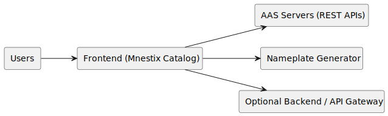

# Software Architecture Specification

**Author:** Bruno Lange  

**Date of last revision:** 18.11.2025  

---

## 1. Introduction

### 1.1 Purpose  
This SAS defines the architecture for enhancing the Mnestix Browser product catalog. It establishes system context, architectural structure, primary interfaces, constraints, and the rationale behind core decisions.

### 1.2 Scope  
**Included:** 
* repository configuration
* filtering/sorting
* lazy thumbnails
* Nameplate integration
* submodel rendering (BOM, TechnicalData, HandoverDocumentation)
* basic cart.  

**Excluded:** 
* payment features
* redesign of authentication
* AAS server implementation
* full rewrite of Mnestix core.

---

## 2. Stakeholders & Concerns

- **End users:** usable product navigation, clarity, responsiveness.  
- **Admins:** repository toggling, configuration transparency.  
- **Developers:** maintainability, modularity, testability.  
- **Integrators:** stable, uniform REST interactions.  
- **Lecturer/Community:** correctness, clarity, scope alignment.

Key concerns: performance, reliability, interoperability, scalability, maintainability.

---

## 3. Context & System Overview

### 3.1 System Context Diagram
<!--
@startuml
left to right direction

rectangle "Users" as User
rectangle "Frontend (Mnestix Catalog)" as FE
rectangle "AAS Servers (REST APIs)" as AAS
rectangle "Nameplate Generator" as Nameplate
rectangle "Optional Backend / API Gateway" as OptBackend

User PFEIL FE
FE PFEIL AAS
FE PFEIL Nameplate
FE PFEIL OptBackend

@enduml
replace PFEIL with -->

**Architecture Style:** Client–server, REST/JSON, asynchronous data loading.  
**Data:** Distributed across multiple AAS servers; local browser persistence for preferences.

---

## 4. Goals & Constraints

### 4.1 Architectural Goals
The Mnestix browser UI should be improved on the aspects of usability and clarity for average users. Lazy loading of images and non-blocking loading of AAS-repositories should be achieved. Failures of some (not all) repositories will be handled gracefully and not constitute a crash or unclear behaviour on the client's side. The code structure should be held maintainable and modular.

### 4.2 Constraints
A short timeline and the existing Mnestix codebase can interfere with fast development, since the means for deeper change are not available. Payment integration for the shopping cart feature is subject to change, since the decision, which payment provider to use is a business (cost) driven decision and not about architecture. Therefore a consultation of Stakeholders on which payment providers to implement will be needed. 

---

## 5. Key Requirements

* Repositories can be enabled and disabled
* Item filtering
* Lazy-loaded images
* Product detail including Nameplate and submodels  
* Basic shopping cart functionality  

---

## 6. Architectural Decisions

### ADR Summary  
- **REST communication:** interoperability and statelessness.  
- **Async loading:** avoids UI blocking.  
- **Lazy loading:** reduces bandwidth and improves responsiveness.  
- **Modular architecture:** isolates responsibilities.  
- **Frontend filtering:** efficient handling and user-controlled data manipulation (per user preference).  
- **Local browser storage:** simple persistence of non-sensitive data.

---

## 7. Architectural Views

### 7.1 Logical Architecture Diagram

```mermaid
graph LR
  subgraph UI[UI Layer]
    Header[Header / Login Status]
    RepoConfig[Repository Config]
    Catalog[Product List]
    Details[Product Detail]
    CartView[Cart]
  end

  subgraph Services[Service Layer]
    CatalogService
    FilterSortService
    RepositoryManager
    CartManager
    HttpClient["HTTP Client (Async)"]
  end

  subgraph Integrations[Integrations]
    NameplateGen[Nameplate Generator]
    AASAPI[AAS REST Endpoints]
  end

  UI --> Services
  Services --> Integrations
```

### 7.2 Requirements Traceability Matrix

This section maps each SRS requirement to the implementing software module(s) and architectural layer.

#### Functional Requirements

| SRS Requirement | Module/Component | Implementation Path | Layer |
|----------------|------------------|---------------------|-------|
| **FR.001** - Login status symbol in menu bar | Header Component | `/src/components/Header/LoginStatusIndicator.tsx` [To be implemented] | UI Layer |
| **FR.002** - Integrate login functions into status symbol | Header Component | `/src/components/Header/LoginStatusIndicator.tsx` [To be implemented] | UI Layer |
| **FR.003** - Display AAS entry count per repository | Repository Config Dialog, RepositoryManager Service | `/src/components/RepositoryConfig/RepositoryList.tsx` [To be implemented] `/src/services/RepositoryManager.ts` [To be implemented] | UI Layer / Service Layer |
| **FR.004** - Nameplate Generator access from product context menu | Product Detail Component, Nameplate Integration | `/src/components/ProductDetail/ContextMenu.tsx` [To be implemented] `/src/lib/integrations/NameplateGenerator.ts` [To be implemented] | UI Layer / Integration Layer |
| **FR.005** - Display specific columns in AAS list | Product List Component | `/src/components/Catalog/ProductList.tsx` [To be implemented] `/src/components/Catalog/ProductTable.tsx` [To be implemented] | UI Layer |
| **FR.006** - Filter AAS list by query parameters | Filter Component, FilterSortService | `/src/components/Catalog/FilterPanel.tsx` [To be implemented] `/src/services/FilterSortService.ts` [To be implemented] | UI Layer / Service Layer |
| **FR.007** - Sort AAS list by columns | Product List Component, FilterSortService | `/src/components/Catalog/ProductTable.tsx` [To be implemented] `/src/services/FilterSortService.ts` [To be implemented] | UI Layer / Service Layer |
| **FR.008** - Cart view accessible via sidebar at `/cart` | Cart View, Sidebar Navigation | `/src/app/cart/page.tsx` [To be implemented] `/src/components/Sidebar/Navigation.tsx` [To be implemented] | UI Layer |
| **FR.009** - List all cart products in cart view | Cart View Component | `/src/app/cart/page.tsx` [To be implemented] `/src/components/Cart/CartList.tsx` [To be implemented] | UI Layer |
| **FR.010** - Edit product quantities in cart | Cart Item Component, CartManager Service | `/src/components/Cart/CartItem.tsx` [To be implemented] `/src/services/CartManager.ts` [To be implemented] | UI Layer / Service Layer |
| **FR.011** - "Add to cart" button in product view | Product Detail Component, CartManager Service | `/src/components/ProductDetail/AddToCartButton.tsx` [To be implemented] `/src/services/CartManager.ts` [To be implemented] | UI Layer / Service Layer |
| **FR.012** - Display cart product count in sidebar | Sidebar Component, CartManager Service | `/src/components/Sidebar/CartBadge.tsx` [To be implemented] `/src/services/CartManager.ts` [To be implemented] | UI Layer / Service Layer |
| **FR.013** - Enable/disable shop via `.env` flag | Configuration Service | `/src/lib/config/shopConfig.ts` [To be implemented] `.env` file variable `SHOP_ENABLED_FLAG` | Service Layer |
| **FR.014** - External payment provider integration | Payment Integration Module | `/src/lib/integrations/PaymentProvider.ts` [To be implemented] | Integration Layer |
| **FR.015** - Display product price when shop enabled | Product List Component, Product Detail Component | `/src/components/Catalog/ProductCard.tsx` [To be implemented] `/src/components/ProductDetail/PriceDisplay.tsx` [To be implemented] | UI Layer |
| **FR.016** - Enable/disable individual repositories | Repository Config Dialog, RepositoryManager Service | `/src/components/RepositoryConfig/RepositoryToggle.tsx` [To be implemented] `/src/services/RepositoryManager.ts` [To be implemented] | UI Layer / Service Layer |
| **FR.017** - Configure CD repositories | Repository Config Dialog | `/src/components/RepositoryConfig/CDRepositoryConfig.tsx` [To be implemented] | UI Layer |
| **FR.018** - Inspect CD repository contents | CD Repository Browser Component | `/src/components/RepositoryConfig/CDRepositoryBrowser.tsx` [To be implemented] | UI Layer |
| **FR.019** - Improve `SM TechnicalData` submodel formatting | Submodel Renderer Component | `/src/components/Submodels/TechnicalDataRenderer.tsx` [To be implemented] | UI Layer |
| **FR.020** - Improve `HandoverDocumentation` submodel formatting | Submodel Renderer Component | `/src/components/Submodels/HandoverDocumentationRenderer.tsx` [To be implemented] | UI Layer |
| **FR.021** - Navigate through linked AAS references | Submodel Navigation Component | `/src/components/Submodels/AASReferenceLink.tsx` [To be implemented] | UI Layer |

#### Non-Functional Requirements

| SRS Requirement | Module/Component | Implementation Path | Layer |
|----------------|------------------|---------------------|-------|
| **NFR.001** - Load 100 AAS entries in <3s | CatalogService, Lazy Loading Implementation | `/src/services/CatalogService.ts` [To be implemented] `/src/hooks/useLazyLoad.ts` [To be implemented] | Service Layer / UI Layer |
| **NFR.002** - Support 10 concurrent users | Server Configuration, Async Loading Architecture | Next.js server configuration `/src/lib/httpClient.ts` [To be implemented] | Service Layer |
| **NFR.003** - Log configuration changes | RepositoryManager Service, Logging Service | `/src/services/RepositoryManager.ts` [To be implemented] `/src/lib/logging/Logger.ts` [To be implemented] | Service Layer |
| **NFR.004** - Responsive UI on resize/mobile | CSS Responsive Design, Layout Components | Global CSS framework `/src/styles/responsive.css` [To be implemented] All UI components with responsive breakpoints | UI Layer |
| **NFR.005** - Browser compatibility (Chrome, Firefox, Safari) | Next.js Build Configuration | `next.config.js` `package.json` (browserslist) | Build Configuration |
| **NFR.006** - Localization (English, German) | i18n Service, Translation Files | `/src/lib/i18n/translations.ts` [To be implemented] `/public/locales/en.json` [To be implemented] `/public/locales/de.json` [To be implemented] | Service Layer |
| **NFR.007** - Consistent linting and formatting | ESLint, Prettier Configuration | `.eslintrc.json` `.prettierrc` Development tooling | Build Configuration |

---

## 8. Interfaces

### 8.1 External Interfaces  
- `GET /shells` (filter/sort/pagination)  
- `GET /shells/{id}`  
- `GET /concept-descriptions`

### 8.2 Internal Services  

This section describes the internal service architecture with specific file locations and repository links.

#### **CatalogService**
**Responsibility:** Manages product catalog data fetching, caching, and state management.

**Implementation Path:** `/src/services/CatalogService.ts` [To be implemented]

**Repository Link:** [https://github.com/DHBW-TINF24F/Team5-mnestix-product-catalogue/tree/1.5.0-product-catalog/src/services/CatalogService.ts](https://github.com/DHBW-TINF24F/Team5-mnestix-product-catalogue/tree/1.5.0-product-catalog/src/services/CatalogService.ts)

**Related Components:**
- `/src/hooks/useCatalog.ts` [To be implemented] - React hook for catalog data
- `/src/types/Catalog.ts` [To be implemented] - TypeScript type definitions

**Implements Requirements:** FR.005, NFR.001

---

#### **FilterSortService**
**Responsibility:** Handles frontend filtering and sorting logic for product lists.

**Implementation Path:** `/src/services/FilterSortService.ts` [To be implemented]

**Repository Link:** [https://github.com/DHBW-TINF24F/Team5-mnestix-product-catalogue/tree/1.5.0-product-catalog/src/services/FilterSortService.ts](https://github.com/DHBW-TINF24F/Team5-mnestix-product-catalogue/tree/1.5.0-product-catalog/src/services/FilterSortService.ts)

**Related Components:**
- `/src/components/Catalog/FilterPanel.tsx` [To be implemented] - UI for filters
- `/src/hooks/useFilterSort.ts` [To be implemented] - React hook for filter/sort state
- `/src/types/Filter.ts` [To be implemented] - Filter type definitions

**Implements Requirements:** FR.006, FR.007

---

#### **RepositoryManager**
**Responsibility:** Manages AAS repository connections, enabling/disabling repositories, and fetching repository metadata.

**Implementation Path:** `/src/services/RepositoryManager.ts` [To be implemented]

**Repository Link:** [https://github.com/DHBW-TINF24F/Team5-mnestix-product-catalogue/tree/1.5.0-product-catalog/src/services/RepositoryManager.ts](https://github.com/DHBW-TINF24F/Team5-mnestix-product-catalogue/tree/1.5.0-product-catalog/src/services/RepositoryManager.ts)

**Related Components:**
- `/src/components/RepositoryConfig/RepositoryList.tsx` [To be implemented] - Repository list UI
- `/src/components/RepositoryConfig/RepositoryToggle.tsx` [To be implemented] - Enable/disable toggle
- `/src/contexts/RepositoryContext.tsx` [To be implemented] - React Context for repository state
- `/src/types/Repository.ts` [To be implemented] - Repository type definitions

**Implements Requirements:** FR.003, FR.016, FR.017, FR.018, NFR.003

---

#### **CartManager**
**Responsibility:** Manages shopping cart state, add/remove items, quantity updates, and cart persistence.

**Implementation Path:** `/src/services/CartManager.ts` [To be implemented]

**Repository Link:** [https://github.com/DHBW-TINF24F/Team5-mnestix-product-catalogue/tree/1.5.0-product-catalog/src/services/CartManager.ts](https://github.com/DHBW-TINF24F/Team5-mnestix-product-catalogue/tree/1.5.0-product-catalog/src/services/CartManager.ts)

**Related Components:**
- `/src/contexts/CartContext.tsx` [To be implemented] - React Context for cart state
- `/src/hooks/useCart.ts` [To be implemented] - React hook for cart operations
- `/src/components/Cart/CartList.tsx` [To be implemented] - Cart list UI
- `/src/components/Cart/CartItem.tsx` [To be implemented] - Individual cart item
- `/src/types/Cart.ts` [To be implemented] - Cart type definitions

**Implements Requirements:** FR.008, FR.009, FR.010, FR.011, FR.012

---

#### **HTTP Client**
**Responsibility:** Provides async HTTP communication with AAS REST endpoints, handles errors, retries, and request cancellation.

**Implementation Path:** `/src/lib/httpClient.ts` [To be implemented]

**Repository Link:** [https://github.com/DHBW-TINF24F/Team5-mnestix-product-catalogue/tree/1.5.0-product-catalog/src/lib/httpClient.ts](https://github.com/DHBW-TINF24F/Team5-mnestix-product-catalogue/tree/1.5.0-product-catalog/src/lib/httpClient.ts)

**Related Components:**
- `/src/lib/api/aasEndpoints.ts` [To be implemented] - AAS API endpoint definitions
- `/src/types/ApiResponse.ts` [To be implemented] - API response types

**Implements Requirements:** NFR.002

---

### 8.3 UI Layer Components

This section describes the UI layer organization with file locations.

#### **Header Components**
**Location:** `/src/components/Header/`

**Components:**
- `LoginStatusIndicator.tsx` [To be implemented] - FR.001, FR.002
- `NavigationBar.tsx` - Existing Mnestix component

**Repository Link:** [https://github.com/DHBW-TINF24F/Team5-mnestix-product-catalogue/tree/1.5.0-product-catalog/src/components/Header/](https://github.com/DHBW-TINF24F/Team5-mnestix-product-catalogue/tree/1.5.0-product-catalog/src/components/Header/)

---

#### **Catalog Components**
**Location:** `/src/components/Catalog/`

**Components:**
- `ProductList.tsx` [To be implemented] - FR.005
- `ProductTable.tsx` [To be implemented] - FR.005, FR.007
- `ProductCard.tsx` [To be implemented] - FR.015
- `FilterPanel.tsx` [To be implemented] - FR.006
- `LazyImage.tsx` [To be implemented] - NFR.001

**Repository Link:** [https://github.com/DHBW-TINF24F/Team5-mnestix-product-catalogue/tree/1.5.0-product-catalog/src/components/Catalog/](https://github.com/DHBW-TINF24F/Team5-mnestix-product-catalogue/tree/1.5.0-product-catalog/src/components/Catalog/)

---

#### **Product Detail Components**
**Location:** `/src/components/ProductDetail/`

**Components:**
- `AddToCartButton.tsx` [To be implemented] - FR.011
- `ContextMenu.tsx` [To be implemented] - FR.004
- `PriceDisplay.tsx` [To be implemented] - FR.015

**Repository Link:** [https://github.com/DHBW-TINF24F/Team5-mnestix-product-catalogue/tree/1.5.0-product-catalog/src/components/ProductDetail/](https://github.com/DHBW-TINF24F/Team5-mnestix-product-catalogue/tree/1.5.0-product-catalog/src/components/ProductDetail/)

---

#### **Repository Configuration Components**
**Location:** `/src/components/RepositoryConfig/`

**Components:**
- `RepositoryList.tsx` [To be implemented] - FR.003
- `RepositoryToggle.tsx` [To be implemented] - FR.016
- `CDRepositoryConfig.tsx` [To be implemented] - FR.017
- `CDRepositoryBrowser.tsx` [To be implemented] - FR.018

**Repository Link:** [https://github.com/DHBW-TINF24F/Team5-mnestix-product-catalogue/tree/1.5.0-product-catalog/src/components/RepositoryConfig/](https://github.com/DHBW-TINF24F/Team5-mnestix-product-catalogue/tree/1.5.0-product-catalog/src/components/RepositoryConfig/)

---

#### **Cart Components**
**Location:** `/src/components/Cart/`

**Components:**
- `CartList.tsx` [To be implemented] - FR.009
- `CartItem.tsx` [To be implemented] - FR.010

**Repository Link:** [https://github.com/DHBW-TINF24F/Team5-mnestix-product-catalogue/tree/1.5.0-product-catalog/src/components/Cart/](https://github.com/DHBW-TINF24F/Team5-mnestix-product-catalogue/tree/1.5.0-product-catalog/src/components/Cart/)

---

#### **Submodel Renderer Components**
**Location:** `/src/components/Submodels/`

**Components:**
- `TechnicalDataRenderer.tsx` [To be implemented] - FR.019
- `HandoverDocumentationRenderer.tsx` [To be implemented] - FR.020
- `AASReferenceLink.tsx` [To be implemented] - FR.021

**Repository Link:** [https://github.com/DHBW-TINF24F/Team5-mnestix-product-catalogue/tree/1.5.0-product-catalog/src/components/Submodels/](https://github.com/DHBW-TINF24F/Team5-mnestix-product-catalogue/tree/1.5.0-product-catalog/src/components/Submodels/)

---

#### **Sidebar Components**
**Location:** `/src/components/Sidebar/`

**Components:**
- `Navigation.tsx` [To be implemented] - FR.008
- `CartBadge.tsx` [To be implemented] - FR.012

**Repository Link:** [https://github.com/DHBW-TINF24F/Team5-mnestix-product-catalogue/tree/1.5.0-product-catalog/src/components/Sidebar/](https://github.com/DHBW-TINF24F/Team5-mnestix-product-catalogue/tree/1.5.0-product-catalog/src/components/Sidebar/)

---

### 8.4 Integration Layer

#### **Nameplate Generator Integration**
**Location:** `/src/lib/integrations/NameplateGenerator.ts` [To be implemented]

**Repository Link:** [https://github.com/DHBW-TINF24F/Team5-mnestix-product-catalogue/tree/1.5.0-product-catalog/src/lib/integrations/NameplateGenerator.ts](https://github.com/DHBW-TINF24F/Team5-mnestix-product-catalogue/tree/1.5.0-product-catalog/src/lib/integrations/NameplateGenerator.ts)

**Implements Requirements:** FR.004

---

#### **Payment Provider Integration**
**Location:** `/src/lib/integrations/PaymentProvider.ts` [To be implemented]

**Repository Link:** [https://github.com/DHBW-TINF24F/Team5-mnestix-product-catalogue/tree/1.5.0-product-catalog/src/lib/integrations/PaymentProvider.ts](https://github.com/DHBW-TINF24F/Team5-mnestix-product-catalogue/tree/1.5.0-product-catalog/src/lib/integrations/PaymentProvider.ts)

**Implements Requirements:** FR.014

---

### 8.5 Pages (Next.js App Router)

**Location:** `/src/app/`

**Pages:**
- `/src/app/cart/page.tsx` [To be implemented] - Cart view page (FR.008)
- `/src/app/catalog/page.tsx` - Existing catalog page (enhanced)
- `/src/app/product/[id]/page.tsx` - Existing product detail page (enhanced)

**Repository Link:** [https://github.com/DHBW-TINF24F/Team5-mnestix-product-catalogue/tree/1.5.0-product-catalog/src/app/](https://github.com/DHBW-TINF24F/Team5-mnestix-product-catalogue/tree/1.5.0-product-catalog/src/app/)

---

## 9. Quality Attributes  

**Performance:** <3s initial list load (NFR.001); lazy thumbnails (NFR.001).  
**Reliability:** tolerate AAS repository failure; concurrent user support (NFR.002).  
**Maintainability:** modular; testable service boundaries; consistent code formatting (NFR.007).  
**Security:** HTTPS, validated filters, no credentials stored locally.  
**Usability:** Responsive UI design (NFR.004); localized interface (NFR.006).  
**Compatibility:** Modern browser support (NFR.005).

---

## 10. Security  
If authentication is needed, reusing the existing Mnestix Backend (proxy) is the simplest solution, since Keycloak OAuth2 is built in and already tested and used. In case a public deployment is created, it should use TLS (https) encryption and not expose any irrelevant endpoints.

---

## 11. Testing & Operations  
- Automated testing for the web services
- Integration tests with mock AAS
- Basic monitoring of AAS endpoint failures
- Configuration change logging (NFR.003)
