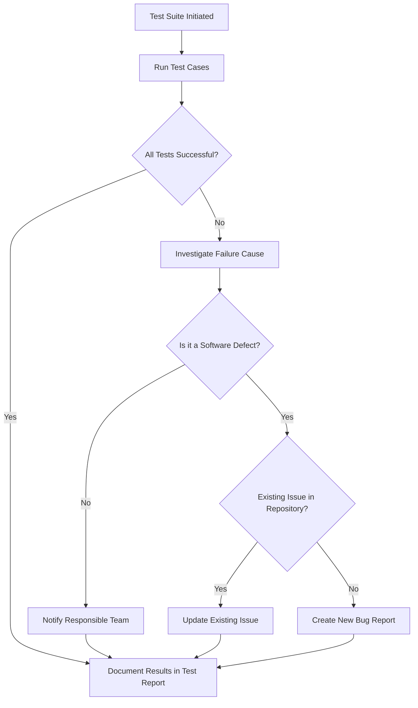

<h1 align="center">System Test Plan for Mnestix Browser extension</h1>
<h3 align="center"> Customer: Rentschler, Wojcik, XITASO</h3>
<h3 align="center"> Created by Nils Schäffner</h3>

# TABLE OF CONTENTS

1. [**Introduction**](#introduction)
2. [**Scope**](#scope)
    * [In-Scope](#in-scope)
    * [Out-of-Scope](#out-of-scope)
3. [**Test Preparation Strategy**](#test-preperation-strategy)
4. [**Test Specification**](#test-specification)
    * [**TS-USER-01** (Login functions)](#ts-user-01)
        * [TC-LOGIN-C-001](#tc-login-c-001)
    * [**TS-REPOSITORY-02** (Repository Management)](#ts-repository-02)
        * [TC-REPCOUNT-C-002](#tc-repcount-c-002)
        * [TC-CONFIG-F-003](#tc-config-f-003)
        * [TC-CONFIG-F-004](#tc-config-f-004)
        * [TC-CONFIG-F-005](#tc-config-f-005)
    * [**TC-AAS-LIST** (Asset Administration Shell List)](#tc-aas-list)
        * [TC-SORTING-F-006](#tc-sorting-f-006)
        * [TC-QUERY-F-007](#tc-query-f-007)
    * [**TS-SHOPPING-CART-03** (Cart System)](#ts-shopping-cart-03)
        * [TC-CART-F-008](#tc-cart-f-008)
        * [TC-CART-F-009](#tc-cart-f-009)
        * [TC-CART-F-010](#tc-cart-f-010)
        * [TC-CART-F-011](#tc-cart-f-011)
5. [**TS-NON-FUNCTIONAL-REQUIREMENTS-04**](#ts-non-functional-requirements-04)
    * [TC-NFR-PERF-012 (Performance)](#tc-nfr-perf-012)
    * [TC-NFR-SEC-013 (Security/Audit)](#tc-nfr-sec-013)
    * [TC-NFR-USE-014 (Usability/Responsive)](#tc-nfr-use-014)
    * [TC-NFR-COMP-015 (Compatibility)](#tc-nfr-comp-015)
    * [TC-NFR-MAINT-016 (Maintenance)](#tc-nfr-maint-016)
6. [**TS-ARTIFICIAL-INTELLIGENCE-ANALYSIS-05**](#ts-artificial-intelligence-analysis-05)
    * [TC-QUALITY-AI-017 (Static Code Analysis)](#tc-quality-ai-017)
    * [TC-QUALITY-AI-018 (Log Analysis)](#tc-quality-ai-018)
7. [**Traceability Matrix**](#traceability-matrix)
8. [**Test Execution Strategy and Roles**](#test-execution-strategy-and-roles)
9. [**Incident Management**](#incident-management)
# Introduction

This document outlines the testing approach and procedures for the ongoing development of the **Mnestix Product Catalogue**. The purpose of this test plan is to ensure the system's functionality, reliability, and overall quality before its final release.  

The **Mnestix Product Catalogue** is a web-based application that allows users to efficiently manage products, search and filter information, and access detailed product data through an intuitive, user-friendly interface. Recent enhancements include advanced filtering options, optimized search algorithms, and the integration of additional product information, all aimed at improving the overall user experience and data management capabilities.  

The testing activities described in this plan will utilize a combination of **classic manual and automated testing methods** alongside **modern approaches leveraging AI-based tools**, enabling intelligent test case generation, predictive analysis of potential defects, and enhanced coverage of complex system interactions. Results from these tests will be consolidated in a **System Test Report ([STR](./TINF24F_5-STR-0v1.md))**, providing a comprehensive record of findings, identified issues, and areas for improvement.  

By adopting this structured and hybrid testing approach, the development team ensures that the **Mnestix Product Catalogue** not only meets all functional and quality requirements but also delivers a reliable and optimized experience for its end users.

# Scope
## In-Scope
The scope of this Software Test Plan is to ensure that all newly developed features and functionalities of the application are thoroughly tested and meet the requirements defined in the [Software Requirement Specification (SRS)](./TINF24F_5-SRS-0v1.md). 

This test plan covers:

- **Newly implemented features**: All functionalities that have been added as part of the current development cycle.  
- **Modified existing features**: Any previously existing features that have been updated, enhanced, or otherwise changed during the current implementation.  
- **Integration of components**: Interactions between newly implemented and existing modules, ensuring proper integration and correct system behavior.  

## Out-of-Scope
Features or components **not in scope** for this testing effort include:

- Legacy modules that remain unchanged and unaffected by the current development.  
- External services or third-party systems outside the control of the development team.  

By defining this scope, the test plan ensures that testing resources are focused on areas with the highest impact, while explicitly clarifying what is and is not covered during this testing cycle.

# Test Preperation Strategy
The test strategy is primarily based on a requirements-based (Anforderungsbasiert) as well as a use-case-based (Anwendungsbasiert) approach, ensuring that both functional requirements and realistic user scenarios are thoroughly covered.

Since most of the implemented features focus on usability improvements on the frontend—particularly regarding user interaction—the main testing method applied is black-box testing. This approach is well-suited because these features do not depend on critical backend routines or significant changes in the system’s internal logic. Therefore, validating the external behavior of the system is sufficient in most cases, and the use of white-box testing is not required for every feature.

However, white-box testing is applied selectively for components that involve more complex internal logic. For example, features such as data sorting or other processing mechanisms require a deeper verification of internal structures and control flows. In such cases, white-box tests are introduced to ensure correctness and robustness.

Additionally, before any code changes are merged into the main branch, a code review process is conducted. At least one team member performs both static and dynamic analysis of the changes to ensure code quality from the outset. This helps identify potential defects early and maintains a consistently high standard of implementation.

To further enhance test effectiveness, techniques such as boundary value analysis are incorporated. This allows testers to focus on edge cases where errors are more likely to occur. Combined with carefully designed test cases, this approach enables deeper testing while maintaining efficiency.

Overall, the test suites are designed with the goal of achieving high quality under economically reasonable conditions, following the principle of “as many tests as necessary, but as few as possible.” This ensures an optimal balance between test coverage, effort, and development speed.

# Test specification

## TS-USER-01
### TC-LOGIN-C-001
<table>
  <tr>
    <th colspan="3">Test Case</th>
  </tr>
  <tr>
    <td><b>ID</b></td>
    <td colspan="2">TC-LOGIN-C-001</td>
  </tr>
  <tr>
    <td><b>Name</b></td>
    <td colspan="2">Login functions</td>
  </tr>
  <tr>
    <td><b>REQ_ID</b></td>
    <td colspan="2">TO DO, 1,2</td>
  </tr>
  <tr>
    <td><b>Description</b></td>
    <td colspan="2">
This test case verifies the correct functionality of the new login button. 
It verifies the correct display of the new button and the support of every account feature. 
The test setup consists of the latest version of mnestix and the version before the implementation commit 
<a href="https://github.com/DHBW-TINF24F/Team5-mnestix-product-catalogue/commit/c01aa0f499a8e04d0220c3b361ed3c98c5483295">c01aa0f</a>.
</td>
<tr>
  <th colspan="3">Test Steps</th>
</tr>
  <tr>
    <th>Step</th>
    <th>Action</th>
    <th>Expected Result</th>
  </tr>
  <tr>
    <td>1</td>
    <td>Visit Mnestix and view dashboard</td>
    <td>Dashboard is visible</td>
  </tr>
  <tr>
  <td>2</td>
  <td>Search for the user icon in the upper right corner</td>
  <td>User finds the icon in the upper right corner</td>
</tr>
<tr>
  <td>3</td>
  <td>Hover over or click on the user icon</td>
  <td>A properties dialog with different account options appears</td>
</tr>
<tr>
  <td>4</td>
  <td>Enter correct login credentials</td>
  <td>User is successfully logged in</td>
</tr>
<tr>
  <td>5</td>
  <td>Select "Log out"</td>
  <td>User is logged out</td>
</tr>
<tr>
  <td>6</td>
  <td>Log in again</td>
  <td>User is logged in again</td>
</tr>
<tr>
  <td>7</td>
  <td>Open the old Mnestix version, access the login menu, and collect account options</td>
  <td>The new dropdown menu in the latest Mnestix version provides the same account options and links them correctly</td>
</tr>
</table>

## TS-REPOSITORY-02
### TC-REPCOUNT-C-002
<table>
  <tr>
    <th colspan="3">Test Case</th>
  </tr>
  <tr>
    <td><b>ID</b></td>
    <td colspan="2">TC-REPCOUNT-C-002</td>
  </tr>
  <tr>
    <td><b>Name</b></td>
    <td colspan="2">Repository entry counts</td>
  </tr>
  <tr>
    <td><b>REQ_ID</b></td>
    <td colspan="2">TO DO , 3</td>
  </tr>
  <tr>
    <td><b>Description</b></td>
    <td colspan="2">
This test case verifies the correct functionality of the new repository setting feature. 
It verifies that the correct number is displayed next to the repository. 
</td>
<tr>
  <th colspan="3">Test Steps</th>
</tr>
  <tr>
    <th>Step</th>
    <th>Action</th>
    <th>Expected Result</th>
  </tr>
  <tr>
    <td>1</td>
    <td>Open Mnestix Browser</td>
    <td>Dashboard is visible</td>
  </tr>
  <tr>
  <td>2</td>
  <td>Enter repository settings menu</td>
  <td>Activated repositories are displayed </td>
</tr>
<tr>
  <td>3</td>
  <td>Check the number next to the repository name</td>
  <td>The correct number is displayed next to each repository depending on the amount of entries</td>
</tr>
</table>

### TC-CONFIG-F-003
<table>
  <tr>
    <th colspan="3">Test Case</th>
  </tr>
  <tr>
    <td><b>ID</b></td>
    <td colspan="2">TC-CONFIG-F-003</td>
  </tr>
  <tr>
    <td><b>Name</b></td>
    <td colspan="2">Enable and Disable AAS Repositories</td>
  </tr>
  <tr>
    <td><b>REQ_ID</b></td>
    <td colspan="2">FR.016</td>
  </tr>
  <tr>
    <td><b>Description</b></td>
    <td colspan="2">
This test verifies that users can enable and disable individual AAS repositories via the configuration dialog.
    </td>
  </tr>
  <tr>
    <th colspan="3">Test Steps</th>
  </tr>
  <tr>
    <th>Step</th>
    <th>Action</th>
    <th>Expected Result</th>
  </tr>
  <tr>
    <td>1</td>
    <td>Open the application and navigate via sidebar to "Einstellungen" → "Datenquellen"</td>
    <td>Configuration page is displayed</td>
  </tr>
  <tr>
    <td>2</td>
    <td>Verify that a list of AAS repositories is shown</td>
    <td>All configured repositories are visible</td>
  </tr>
  <tr>
    <td>3</td>
    <td>Click on "Alles bearbeiten" for a repository entry</td>
    <td>Edit dialog opens with repository details</td>
  </tr>
  <tr>
    <td>4</td>
    <td>Toggle the active/inactive switch to disable the repository</td>
    <td>Repository is marked as inactive</td>
  </tr>
  <tr>
    <td>5</td>
    <td>Save changes and return to overview</td>
    <td>Repository remains inactive in the list</td>
  </tr>
  <tr>
    <td>6</td>
    <td>Re-enable the repository using the same toggle</td>
    <td>Repository is marked as active again</td>
  </tr>
</table>

### TC-CONFIG-F-004
<table>
  <tr>
    <th colspan="3">Test Case</th>
  </tr>
  <tr>
    <td><b>ID</b></td>
    <td colspan="2">TC-CONFIG-F-004</td>
  </tr>
  <tr>
    <td><b>Name</b></td>
    <td colspan="2">Configure CD Repositories</td>
  </tr>
  <tr>
    <td><b>REQ_ID</b></td>
    <td colspan="2">FR.017</td>
  </tr>
  <tr>
    <td><b>Description</b></td>
    <td colspan="2">
This test verifies that users can view and modify configuration parameters of CD repositories via the configuration dialog.
    </td>
  </tr>
  <tr>
    <th colspan="3">Test Steps</th>
  </tr>
  <tr>
    <th>Step</th>
    <th>Action</th>
    <th>Expected Result</th>
  </tr>
  <tr>
    <td>1</td>
    <td>Navigate to "/de/settings" or via sidebar to "Einstellungen" → "Datenquellen"</td>
    <td>Configuration page is displayed</td>
  </tr>
  <tr>
    <td>2</td>
    <td>Select a CD repository entry and click "Alles bearbeiten"</td>
    <td>Edit dialog opens</td>
  </tr>
  <tr>
    <td>3</td>
    <td>Inspect available fields (Name, Image URL, AAS Repository URL, AAS Searcher URL)</td>
    <td>All fields are visible and populated</td>
  </tr>
  <tr>
    <td>4</td>
    <td>Modify one or more fields (e.g. change repository name or URL)</td>
    <td>Updated values are accepted in input fields</td>
  </tr>
  <tr>
    <td>5</td>
    <td>Save changes</td>
    <td>Changes are persisted and reflected in the repository list</td>
  </tr>
  <tr>
    <td>6</td>
    <td>Reload the page</td>
    <td>Modified values remain unchanged (persisted correctly)</td>
  </tr>
</table>

### TC-CONFIG-F-005
<table>
  <tr>
    <th colspan="3">Test Case</th>
  </tr>
  <tr>
    <td><b>ID</b></td>
    <td colspan="2">TC-CONFIG-F-005</td>
  </tr>
  <tr>
    <td><b>Name</b></td>
    <td colspan="2">Inspect CD Repository Content</td>
  </tr>
  <tr>
    <td><b>REQ_ID</b></td>
    <td colspan="2">FR.018</td>
  </tr>
  <tr>
    <td><b>Description</b></td>
    <td colspan="2">
This test verifies that users can inspect the contents of configured CD repositories via the user interface.
    </td>
  </tr>
  <tr>
    <th colspan="3">Test Steps</th>
  </tr>
  <tr>
    <th>Step</th>
    <th>Action</th>
    <th>Expected Result</th>
  </tr>
  <tr>
    <td>1</td>
    <td>Navigate to "Einstellungen" → "Datenquellen"</td>
    <td>Repository overview is displayed</td>
  </tr>
  <tr>
    <td>2</td>
    <td>Select an active CD repository</td>
    <td>Repository can be interacted with</td>
  </tr>
  <tr>
    <td>3</td>
    <td>Trigger inspection (e.g. open details / view content via UI)</td>
    <td>Repository content view is opened</td>
  </tr>
  <tr>
    <td>4</td>
    <td>Verify that repository data (e.g. entries, assets, or structures) is displayed</td>
    <td>Content is visible and structured</td>
  </tr>
  <tr>
    <td>5</td>
    <td>Interact with content (e.g. expand elements, navigate entries)</td>
    <td>Content can be browsed without errors</td>
  </tr>
</table>

## TC-AAS-LIST
### TC-SORTING-F-006
<table>
  <tr>
    <th colspan="3">Test Case</th>
  </tr>
  <tr>
    <td><b>ID</b></td>
    <td colspan="2">TC-SORTING-F-006</td>
  </tr>
  <tr>
    <td><b>Name</b></td>
    <td colspan="2">Asset List Sorting</td>
  </tr>
  <tr>
    <td><b>REQ_ID</b></td>
    <td colspan="2">TO DO: 5,7 </td>
  </tr>
  <tr>
    <td><b>Description</b></td>
    <td colspan="2">
This test case verifies the correct functionality of the new sorting logic for the asset list. 
It verifies the correct sorting logic for the columns ManufacturerName, ProductDesignation, OrderCode, ManufacturerCode, GlobalAssetId, and CreatedAt.
The test setup consists of the latest version of the mnestix browser and is supported by an additional unit test.
</td>
<tr>
  <th colspan="3">Test Steps</th>
</tr>
  <tr>
    <th>Step</th>
    <th>Action</th>
    <th>Expected Result</th>
  </tr>
  <tr>
    <td>1</td>
    <td>Navigate to AAS List</td>
    <td>An unsorted AAS List is visible</td>
  </tr>
  <tr>
  <td>2</td>
  <td>Verify that the correct test data is inserted</td>
  <td>Correct entries are shown in the table</td>
</tr>
  <tr>
  <td>3</td>
  <td>Hover over an abitrary column</td>
  <td>Small arrows implying sorting are visible</td>
</tr>
<tr>
  <td>4</td>
  <td>Click on any colum header</td>
  <td>Column is sorted alphabetically</td>
</tr>
</table>

<table>
  <tr>
    <th colspan="5">Test Data – TD-SORTING-F-006</th>
  </tr>
  <tr>
    <td><b>Repository</b></td>
    <td colspan="4">http://mnestix-api:5064/repo</td>
  </tr>
  <tr>
    <th>#</th>
    <th>Dataset / Column</th>
    <th>Sort Order</th>
    <th>First Entry</th>
    <th>Result</th>
  </tr>
  <tr>
    <td>1</td>
    <td>Manufacturer Name</td>
    <td>A–Z</td>
    <td>Gottfried Wilhelm Leibniz Universität Hannover</td>
    <td>PASS</td>
  </tr>
  <tr>
    <td>2</td>
    <td>Manufacturer Name</td>
    <td>A–Z</td>
    <td>XITASO GmbH</td>
    <td>FAIL</td>
  </tr>
  <tr>
    <td>3</td>
    <td>Asset ID</td>
    <td>A–Z</td>
    <td>https://aas2.uni-h.de/lni0729</td>
    <td>PASS</td>
  </tr>
  <tr>
    <td>4</td>
    <td>AAS ID</td>
    <td>Z–A</td>
    <td>https://aas2.uni-h.de/lni0729</td>
    <td>FAIL</td>
  </tr>
  <tr>
    <td>5</td>
    <td>Product Designation</td>
    <td>A–Z</td>
    <td>Individueller Kugelschreiber</td>
    <td>PASS</td>
  </tr>
</table>

### TC-QUERY-F-007
<table>
  <tr>
    <th colspan="3">Test Case</th>
  </tr>
  <tr>
    <td><b>ID</b></td>
    <td colspan="2">TC-QUERY-F-007</td>
  </tr>
  <tr>
    <td><b>Name</b></td>
    <td colspan="2">AAS List Query Filter</td>
  </tr>
  <tr>
    <td><b>REQ_ID</b></td>
    <td colspan="2">TO DO: 6</td>
  </tr>
  <tr>
    <td><b>Description</b></td>
    <td colspan="2">
This test case verifies the correct functionality of the new filtering logic for the asset list. 
It verifies that user input filters result in an AAS list that only contains matching items
The test setup consists of the latest version of the mnestix browser.
</td>
<tr>
  <th colspan="3">Test Steps</th>
</tr>
  <tr>
    <th>Step</th>
    <th>Action</th>
    <th>Expected Result</th>
  </tr>
  <tr>
    <td>1</td>
    <td>Navigate to AAS List</td>
    <td>All items are displayed</td>
  </tr>
  <tr>
  <td>2</td>
  <td>Verify that the correct test data is inserted</td>
  <td>Correct entries are shown in the table</td>
</tr>
  <tr>
  <td>3</td>
  <td>Insert test data into query bar</td>
  <td>Output as definded in TEST DATA</td>
</tr>
</table>

<table>
  <tr>
    <th colspan="5">Test Data – TD-QUERY-F-007</th>
  </tr>
  <tr>
    <td><b>Repository</b></td>
    <td colspan="4">http://mnestix-api:5064/repo</td>
  </tr>
  <tr>
    <th>#</th>
    <th>Query</th>
    <th>Contains</th>
    <th>Result</th>
  </tr>
  <tr>
    <td>1</td>
    <td>Kugelschreiber</td>
    <td>Individueller Kugelschreiber - Gottfried Wilhelm Leibniz Universität Hannover</td>
    <td>PASS</td>
  </tr>
  <tr>
    <td>2</td>
    <td>Kugelschreiber</td>
    <td>XITASO GmbH</td>
    <td>FAIL</td>
  </tr>
  <tr>
    <td>3</td>
    <td>https://aas2.uni-h.de/lni0729</td>
    <td>https://aas2.uni-h.de/lni0729</td>
    <td>PASS</td>
  </tr>
  <tr>
    <td>4</td>
    <td>https://</td>
    <td>https://aas2.uni-h.de/lni0729</td>
    <td>FAIL</td>
  </tr>
</table>

## TS-SHOPPING-CART-03
### TC-CART-F-008
<table>
  <tr>
    <th colspan="3">Test Case</th>
  </tr>
  <tr>
    <td><b>ID</b></td>
    <td colspan="2">TC-CART-F-008</td>
  </tr>
  <tr>
    <td><b>Name</b></td>
    <td colspan="2">Cart View Accessibility and Sidebar Counter</td>
  </tr>
  <tr>
    <td><b>REQ_ID</b></td>
    <td colspan="2">FR.008, FR.012</td>
  </tr>
  <tr>
    <td><b>Description</b></td>
    <td colspan="2">
This test verifies that the cart view is accessible via the sidebar and the URL path "/cart".
It also verifies that the sidebar correctly displays the number of items in the cart.
    </td>
  </tr>
  <tr>
    <th colspan="3">Test Steps</th>
  </tr>
  <tr>
    <th>Step</th>
    <th>Action</th>
    <th>Expected Result</th>
  </tr>
  <tr>
    <td>1</td>
    <td>Click on cart icon in sidebar</td>
    <td>Cart view is displayed</td>
  </tr>
  <tr>
    <td>2</td>
    <td>Navigate directly to "/cart"</td>
    <td>Cart view is displayed</td>
  </tr>
  <tr>
    <td>3</td>
    <td>Add products to cart</td>
    <td>Sidebar counter increases accordingly</td>
  </tr>
</table>

### TC-CART-F-009
<table>
  <tr>
    <th colspan="3">Test Case</th>
  </tr>
  <tr>
    <td><b>ID</b></td>
    <td colspan="2">TC-CART-F-009</td>
  </tr>
  <tr>
    <td><b>Name</b></td>
    <td colspan="2">Add Product to Cart and Verify Listing</td>
  </tr>
  <tr>
    <td><b>REQ_ID</b></td>
    <td colspan="2">FR.009, FR.011</td>
  </tr>
  <tr>
    <td><b>Description</b></td>
    <td colspan="2">
This test verifies that products can be added to the cart using the "Add to cart" button 
and that all added products are correctly listed in the cart view.
    </td>
  </tr>
  <tr>
    <th colspan="3">Test Steps</th>
  </tr>
  <tr>
    <th>Step</th>
    <th>Action</th>
    <th>Expected Result</th>
  </tr>
  <tr>
    <td>1</td>
    <td>Navigate to a product detail page</td>
    <td>Product details are displayed</td>
  </tr>
  <tr>
    <td>2</td>
    <td>Click "Add to cart"</td>
    <td>Product is added to cart</td>
  </tr>
  <tr>
    <td>3</td>
    <td>Navigate to cart view</td>
    <td>Product appears in cart list</td>
  </tr>
  <tr>
    <td>4</td>
    <td>Add multiple different products</td>
    <td>All products are listed correctly</td>
  </tr>
</table>

<table>
  <tr>
    <th colspan="5">Test Data – TD-CART-F-009</th>
  </tr>
  <tr>
    <th>#</th>
    <th>Product</th>
    <th>Action</th>
    <th>Expected in Cart</th>
    <th>Result</th>
  </tr>
  <tr>
    <td>1</td>
    <td>Individueller Kugelschreiber</td>
    <td>Add once</td>
    <td>Individueller Kugelschreiber (Qty: 1)</td>
    <td>PASS</td>
  </tr>
  <tr>
    <td>2</td>
    <td>Xitaso GmbH</td>
    <td>Add twice</td>
    <td>Xitaso GmbH (Qty: 2)</td>
    <td>PASS</td>
  </tr>
  <tr>
    <td>3</td>
    <td>Any product</td>
    <td>Do not add</td>
    <td>Not listed</td>
    <td>PASS</td>
  </tr>
</table>

### TC-CART-F-010
<table>
  <tr>
    <th colspan="3">Test Case</th>
  </tr>
  <tr>
    <td><b>ID</b></td>
    <td colspan="2">TC-CART-F-010</td>
  </tr>
  <tr>
    <td><b>Name</b></td>
    <td colspan="2">Edit Cart Quantity and Shop Feature Toggle</td>
  </tr>
  <tr>
    <td><b>REQ_ID</b></td>
    <td colspan="2">FR.010, FR.013</td>
  </tr>
  <tr>
    <td><b>Description</b></td>
    <td colspan="2">
This test verifies that product quantities can be modified in the cart view.
Additionally, it verifies that the shop functionality can be enabled or disabled 
via the environment variable SHOP_ENABLED_FLAG.
    </td>
  </tr>
  <tr>
    <th colspan="3">Test Steps</th>
  </tr>
  <tr>
    <th>Step</th>
    <th>Action</th>
    <th>Expected Result</th>
  </tr>
  <tr>
    <td>1</td>
    <td>Add product to cart</td>
    <td>Product appears with quantity = 1</td>
  </tr>
  <tr>
    <td>2</td>
    <td>Increase quantity</td>
    <td>Quantity is updated correctly</td>
  </tr>
  <tr>
    <td>3</td>
    <td>Decrease quantity</td>
    <td>Quantity decreases accordingly</td>
  </tr>
  <tr>
    <td>4</td>
    <td>Set SHOP_ENABLED_FLAG=false and reload app</td>
    <td>Shop/cart functionality is disabled or hidden</td>
  </tr>
  <tr>
    <td>5</td>
    <td>Set SHOP_ENABLED_FLAG=true and reload app</td>
    <td>Shop/cart functionality is enabled</td>
  </tr>
</table>

<table>
  <tr>
    <th colspan="5">Test Data – TD-CART-F-010</th>
  </tr>
  <tr>
    <th>#</th>
    <th>Initial Qty</th>
    <th>Action</th>
    <th>Expected Qty</th>
    <th>Result</th>
  </tr>
  <tr>
    <td>1</td>
    <td>1</td>
    <td>Increase by 1</td>
    <td>2</td>
    <td>PASS</td>
  </tr>
  <tr>
    <td>2</td>
    <td>2</td>
    <td>Decrease by 1</td>
    <td>1</td>
    <td>PASS</td>
  </tr>
  <tr>
    <td>3</td>
    <td>1</td>
    <td>Decrease by 1</td>
    <td>0 (removed or handled)</td>
    <td>PASS</td>
  </tr>
</table>

### TC-CART-F-011
<table>
  <tr>
    <th colspan="3">Test Case</th>
  </tr>
  <tr>
    <td><b>ID</b></td>
    <td colspan="2">TC-CART-F-011</td>
  </tr>
  <tr>
    <td><b>Name</b></td>
    <td colspan="2">Display Product Price when Shop Enabled</td>
  </tr>
  <tr>
    <td><b>REQ_ID</b></td>
    <td colspan="2">FR.015</td>
  </tr>
  <tr>
    <td><b>Description</b></td>
    <td colspan="2">
This test verifies that each product displays a price when the shop module is enabled.
It also ensures that prices are not shown when the shop functionality is disabled.
    </td>
  </tr>
  <tr>
    <th colspan="3">Test Steps</th>
  </tr>
  <tr>
    <th>Step</th>
    <th>Action</th>
    <th>Expected Result</th>
  </tr>
  <tr>
    <td>1</td>
    <td>Set environment variable SHOP_ENABLED_FLAG=true and start the application</td>
    <td>Application starts with shop functionality enabled</td>
  </tr>
  <tr>
    <td>2</td>
    <td>Navigate to product listing page (e.g. "/products")</td>
    <td>List of products is displayed</td>
  </tr>
  <tr>
    <td>3</td>
    <td>Inspect a product card in the listing view</td>
    <td>A price value is visible for the product (e.g. numeric value with currency)</td>
  </tr>
  <tr>
    <td>4</td>
    <td>Navigate to a product detail page</td>
    <td>Product details are displayed including price</td>
  </tr>
  <tr>
    <td>5</td>
    <td>Verify multiple products in listing</td>
    <td>Each product displays an individual price</td>
  </tr>
  <tr>
    <td>6</td>
    <td>Set environment variable SHOP_ENABLED_FLAG=false and reload the application</td>
    <td>Application starts with shop functionality disabled</td>
  </tr>
  <tr>
    <td>7</td>
    <td>Navigate again to product listing page</td>
    <td>Products are displayed without any price information</td>
  </tr>
</table>

# TS-NON-FUNCTIONAL-REQUIREMENTS-04
### TC-NFR-PERF-012
<table>
  <tr>
    <th colspan="3">Test Case</th>
  </tr>
  <tr>
    <td><b>ID</b></td>
    <td colspan="2">TC-NFR-PERF-012</td>
  </tr>
  <tr>
    <td><b>Name</b></td>
    <td colspan="2">Concurrent User Load Handling</td>
  </tr>
  <tr>
    <td><b>REQ_ID</b></td>
    <td colspan="2">NFR.002</td>
  </tr>
  <tr>
    <td><b>Description</b></td>
    <td colspan="2">
This test verifies that the system can handle at least 10 concurrent users performing typical operations without significant performance degradation.
Basic response times and system stability are observed during the test.
    </td>
  </tr>
  <tr>
    <th colspan="3">Test Steps</th>
  </tr>
  <tr>
    <th>Step</th>
    <th>Action</th>
    <th>Expected Result</th>
  </tr>
  <tr>
    <td>1</td>
    <td>Start backend and frontend services in a test environment</td>
    <td>All services are running and reachable</td>
  </tr>
  <tr>
    <td>2</td>
    <td>Use a load testing tool (e.g. k6, JMeter) to simulate 10 concurrent users</td>
    <td>10 virtual users are active simultaneously</td>
  </tr>
  <tr>
    <td>3</td>
    <td>Execute typical user flows (navigation, API calls, data loading)</td>
    <td>All requests return valid responses (HTTP 200)</td>
  </tr>
  <tr>
    <td>4</td>
    <td>Measure response times during load</td>
    <td>Average response time remains within acceptable range (e.g. &lt; 1s)</td>
  </tr>
  <tr>
    <td>5</td>
    <td>Monitor system logs and resource usage (CPU, memory)</td>
    <td>No errors, crashes, or resource exhaustion observed</td>
  </tr>
</table>

### TC-NFR-SEC-013
<table>
  <tr>
    <th colspan="3">Test Case</th>
  </tr>
  <tr>
    <td><b>ID</b></td>
    <td colspan="2">TC-NFR-SEC-013</td>
  </tr>
  <tr>
    <td><b>Name</b></td>
    <td colspan="2">Audit Logging for Repository Actions</td>
  </tr>
  <tr>
    <td><b>REQ_ID</b></td>
    <td colspan="2">NFR.003</td>
  </tr>
  <tr>
    <td><b>Description</b></td>
    <td colspan="2">
This test verifies that all relevant actions affecting repositories are logged with sufficient detail for auditing purposes.
    </td>
  </tr>
  <tr>
    <th colspan="3">Test Steps</th>
  </tr>
  <tr>
    <th>Step</th>
    <th>Action</th>
    <th>Expected Result</th>
  </tr>
  <tr>
    <td>1</td>
    <td>Start application with logging enabled (e.g. LOG_LEVEL=info/debug)</td>
    <td>Logging system is initialized</td>
  </tr>
  <tr>
    <td>2</td>
    <td>Create a new repository via UI or API</td>
    <td>A log entry is created for the action</td>
  </tr>
  <tr>
    <td>3</td>
    <td>Update repository configuration</td>
    <td>Change is logged with details</td>
  </tr>
  <tr>
    <td>4</td>
    <td>Delete repository</td>
    <td>Deletion is logged</td>
  </tr>
  <tr>
    <td>5</td>
    <td>Inspect log output (file or console)</td>
    <td>
Log entries contain: timestamp, action type, affected resource, and user/context identifier
    </td>
  </tr>
</table>

### TC-NFR-USE-014
<table>
  <tr>
    <th colspan="3">Test Case</th>
  </tr>
  <tr>
    <td><b>ID</b></td>
    <td colspan="2">TC-NFR-USE-014</td>
  </tr>
  <tr>
    <td><b>Name</b></td>
    <td colspan="2">Responsive Layout and Rendering</td>
  </tr>
  <tr>
    <td><b>REQ_ID</b></td>
    <td colspan="2">NFR.004</td>
  </tr>
  <tr>
    <td><b>Description</b></td>
    <td colspan="2">
This test verifies that the UI adapts correctly to different viewport sizes and maintains usability.
    </td>
  </tr>
  <tr>
    <th colspan="3">Test Steps</th>
  </tr>
  <tr>
    <th>Step</th>
    <th>Action</th>
    <th>Expected Result</th>
  </tr>
  <tr>
    <td>1</td>
    <td>Open browser dev tools and set viewport to 1920x1080</td>
    <td>Desktop layout is rendered correctly</td>
  </tr>
  <tr>
    <td>2</td>
    <td>Resize viewport to 1024x768</td>
    <td>Layout adapts without overflow or clipping</td>
  </tr>
  <tr>
    <td>3</td>
    <td>Resize viewport to 375x667 (mobile)</td>
    <td>Mobile layout is activated (e.g. stacked elements, burger menu)</td>
  </tr>
  <tr>
    <td>4</td>
    <td>Inspect DOM and CSS behavior</td>
    <td>No broken layouts, overlapping elements, or horizontal scrolling</td>
  </tr>
  <tr>
    <td>5</td>
    <td>Interact with UI components in each viewport</td>
    <td>All interactive elements remain usable</td>
  </tr>
</table>

### TC-NFR-COMP-015
<table>
  <tr>
    <th colspan="3">Test Case</th>
  </tr>
  <tr>
    <td><b>ID</b></td>
    <td colspan="2">TC-NFR-COMP-015</td>
  </tr>
  <tr>
    <td><b>Name</b></td>
    <td colspan="2">Cross-Browser Functional Compatibility</td>
  </tr>
  <tr>
    <td><b>REQ_ID</b></td>
    <td colspan="2">NFR.005</td>
  </tr>
  <tr>
    <td><b>Description</b></td>
    <td colspan="2">
This test verifies consistent functionality and rendering across supported browsers.
    </td>
  </tr>
  <tr>
    <th colspan="3">Test Steps</th>
  </tr>
  <tr>
    <th>Step</th>
    <th>Action</th>
    <th>Expected Result</th>
  </tr>
  <tr>
    <td>1</td>
    <td>Open application in latest Chrome version</td>
    <td>No console errors, UI renders correctly</td>
  </tr>
  <tr>
    <td>2</td>
    <td>Open application in latest Firefox version</td>
    <td>No console errors, UI renders correctly</td>
  </tr>
  <tr>
    <td>3</td>
    <td>Open application in latest Safari version</td>
    <td>No console errors, UI renders correctly</td>
  </tr>
  <tr>
    <td>4</td>
    <td>Execute key workflows (navigation, CRUD operations)</td>
    <td>Behavior is consistent across browsers</td>
  </tr>
  <tr>
    <td>5</td>
    <td>Check browser console and network tab</td>
    <td>No browser-specific errors or failed requests</td>
  </tr>
</table>

### TC-NFR-MAINT-016
<table>
  <tr>
    <th colspan="3">Test Case</th>
  </tr>
  <tr>
    <td><b>ID</b></td>
    <td colspan="2">TC-NFR-MAINT-016</td>
  </tr>
  <tr>
    <td><b>Name</b></td>
    <td colspan="2">Static Code Analysis Compliance</td>
  </tr>
  <tr>
    <td><b>REQ_ID</b></td>
    <td colspan="2">NFR.007</td>
  </tr>
  <tr>
    <td><b>Description</b></td>
    <td colspan="2">
This test verifies compliance with defined linting and formatting rules using automated tools.
    </td>
  </tr>
  <tr>
    <th colspan="3">Test Steps</th>
  </tr>
  <tr>
    <th>Step</th>
    <th>Action</th>
    <th>Expected Result</th>
  </tr>
  <tr>
    <td>1</td>
    <td>Install project dependencies</td>
    <td>All required tools are available</td>
  </tr>
  <tr>
    <td>2</td>
    <td>Run linting tool (e.g. eslint)</td>
    <td>No linting errors (exit code 0)</td>
  </tr>
  <tr>
    <td>3</td>
    <td>Run formatting check (e.g. prettier --check)</td>
    <td>All files comply with formatting rules</td>
  </tr>
  <tr>
    <td>4</td>
    <td>Run CI pipeline (if available)</td>
    <td>Linting/formatting stage passes successfully</td>
  </tr>
</table>

# TS-ARTIFICIAL-INTELLIGENCE-ANALYSIS-05
### TC-QUALITY-AI-017
<table> <tr> <th colspan="3">Test Case</th> </tr> <tr> <td><b>ID</b></td> <td colspan="2">TC-QUALITY-AI-017</td> </tr> <tr> <td><b>Name</b></td> <td colspan="2">AI-Based Static Code Analysis of Software Components</td> </tr> <tr> <td><b>REQ_ID</b></td> <td colspan="2">-</td> </tr> <tr> <td><b>Description</b></td> <td colspan="2"> This test verifies that an AI-based agent can perform static code analysis across selected software components or the entire codebase. The goal is to identify potential issues such as code smells, security vulnerabilities, performance risks, and architectural inconsistencies without executing the code. </td> </tr> <tr> <th colspan="3">Test Steps</th> </tr> <tr> <th>Step</th> <th>Action</th> <th>Expected Result</th> </tr> <tr> <td>1</td> <td>Provide source code or repository access to the AI agent</td> <td>AI agent successfully ingests and indexes the codebase</td> </tr> <tr> <td>2</td> <td>Execute AI analysis with structured prompt</td> <td>AI returns categorized findings</td> </tr> <tr> <td>3</td> <td>Review reported issues (e.g. bugs, vulnerabilities, smells)</td> <td>Findings are relevant, traceable, and mapped to code locations</td> </tr> <tr> <td>4</td> <td>Validate findings against known issues or manual review</td> <td>AI results are consistent with expected issues or expert evaluation</td> </tr> </table> <table> <tr> <th colspan="4">Test Data – TD-QUALITY-AI-017</th> </tr> <tr> <th>#</th> <th>Input</th> <th>Prompt</th> <th>Expected Output</th> </tr> <tr> <td>1</td> <td>Full repository / selected modules</td> <td> Analyze the provided codebase and identify: - Security vulnerabilities - Code smells - Performance bottlenecks - Architectural issues Provide file paths, line references, and severity levels. </td> <td>Structured report with categorized findings and references</td> </tr> <tr> <td>2</td> <td>Single component (e.g. Cart Service)</td> <td> Perform static analysis on the component and list potential defects, edge cases, and maintainability concerns. Suggest improvements. </td> <td>Component-level analysis with actionable recommendations</td> </tr> </table>

### TC-QUALITY-AI-018
<table> <tr> <th colspan="3">Test Case</th> </tr> <tr> <td><b>ID</b></td> <td colspan="2">TC-QUALITY-AI-018</td> </tr> <tr> <td><b>Name</b></td> <td colspan="2">AI-Based Log Analysis and Failure Detection</td> </tr> <tr> <td><b>REQ_ID</b></td> <td colspan="2">-</td> </tr> <tr> <td><b>Description</b></td> <td colspan="2"> This test verifies that an AI system can analyze application logs to detect anomalies, errors, and root causes of failures. The AI should cluster related log entries, identify error patterns, and provide insights or probable causes. </td> </tr> <tr> <th colspan="3">Test Steps</th> </tr> <tr> <th>Step</th> <th>Action</th> <th>Expected Result</th> </tr> <tr> <td>1</td> <td>Provide application logs (error, warning, info)</td> <td>Logs are successfully ingested by the AI system</td> </tr> <tr> <td>2</td> <td>Run AI log analysis with structured prompt</td> <td>AI processes logs and identifies anomalies</td> </tr> <tr> <td>3</td> <td>Request clustering of related log entries</td> <td>AI groups logs into meaningful failure patterns</td> </tr> <tr> <td>4</td> <td>Review root cause hypotheses</td> <td>AI provides plausible root causes with supporting evidence</td> </tr> </table> <table> <tr> <th colspan="4">Test Data – TD-QUALITY-AI-018</th> </tr> <tr> <th>#</th> <th>Input Logs</th> <th>Prompt</th> <th>Expected Output</th> </tr> <tr> <td>1</td> <td>Mixed logs with stack traces and warnings</td> <td> Analyze the following logs. 1. Identify errors and anomalies 2. Cluster related events 3. Determine likely root causes 4. Provide severity and impacted components </td> <td>Grouped anomalies with explanations and severity classification</td> </tr> <tr> <td>2</td> <td>Error-heavy log segment (e.g. exceptions)</td> <td> Summarize the main failure, identify the root cause, and suggest potential fixes based on the log evidence. </td> <td>Concise root cause analysis with actionable recommendations</td> </tr> </table>

# Traceability Matrix

| Requirement | TC-LOGIN-C-001 | TC-REPCOUNT-C-002 | TC-CONFIG-F-003 | TC-CONFIG-F-004 | TC-CONFIG-F-005 | TC-SORTING-F-006 | TC-QUERY-F-007 | TC-CART-F-008 | TC-CART-F-009 | TC-CART-F-010 | TC-CART-F-011 | TC-NFR-PERF-012 | TC-NFR-SEC-013 | TC-NFR-USE-014 | TC-NFR-COMP-015 | TC-NFR-MAINT-016 |
|------------|---------------|-------------------|-----------------|-----------------|-----------------|------------------|----------------|----------------|----------------|----------------|----------------|------------------|------------------|------------------|------------------|------------------|
| FR.001     | ✔             |                   |                 |                 |                 |                  |                |                |                |                |                |                  |                  |                  |                  |                  |
| FR.002     | ✔             |                   |                 |                 |                 |                  |                |                |                |                |                |                  |                  |                  |                  |                  |
| FR.003     |               | ✔                 |                 |                 |                 |                  |                |                |                |                |                |                  |                  |                  |                  |                  |
| FR.005     |               |                   |                 |                 |                 | ✔                |                |                |                |                |                |                  |                  |                  |                  |                  |
| FR.006     |               |                   |                 |                 |                 |                  | ✔              |                |                |                |                |                  |                  |                  |                  |                  |
| FR.007     |               |                   |                 |                 |                 | ✔                |                |                |                |                |                |                  |                  |                  |                  |                  |
| FR.008     |               |                   |                 |                 |                 |                  |                | ✔              |                |                |                |                  |                  |                  |                  |                  |
| FR.009     |               |                   |                 |                 |                 |                  |                |                | ✔              |                |                |                  |                  |                  |                  |                  |
| FR.010     |               |                   |                 |                 |                 |                  |                |                |                | ✔              |                |                  |                  |                  |                  |                  |
| FR.011     |               |                   |                 |                 |                 |                  |                |                | ✔              |                |                |                  |                  |                  |                  |                  |
| FR.012     |               |                   |                 |                 |                 |                  |                | ✔              |                |                |                |                  |                  |                  |                  |                  |
| FR.013     |               |                   |                 |                 |                 |                  |                |                |                | ✔              |                |                  |                  |                  |                  |                  |
| FR.015     |               |                   |                 |                 |                 |                  |                |                |                |                | ✔              |                  |                  |                  |                  |                  |
| FR.016     |               |                   | ✔               |                 |                 |                  |                |                |                |                |                |                  |                  |                  |                  |                  |
| FR.017     |               |                   |                 | ✔               |                 |                  |                |                |                |                |                |                  |                  |                  |                  |                  |
| FR.018     |               |                   |                 |                 | ✔               |                  |                |                |                |                |                |                  |                  |                  |                  |                  |
| NFR.002    |               |                   |                 |                 |                 |                  |                |                |                |                |                | ✔                |                  |                  |                  |                  |
| NFR.003    |               |                   |                 |                 |                 |                  |                |                |                |                |                |                  | ✔                |                  |                  |                  |
| NFR.004    |               |                   |                 |                 |                 |                  |                |                |                |                |                |                  |                  | ✔                |                  |                  |
| NFR.005    |               |                   |                 |                 |                 |                  |                |                |                |                |                |                  |                  |                  | ✔                |                  |
| NFR.007    |               |                   |                 |                 |                 |                  |                |                |                |                |                |                  |                  |                  |                  | ✔                |

# Test Execution Strategy and Roles

The overall test strategy and execution plan were developed by Nils Schäffner, who is responsible for defining the testing approach, scope, and quality standards, as well as ensuring alignment with the overall project objectives.

Test execution is carried out by Jan Kruse and Robin Kelm, who work closely together following a structured four-eyes principle. For each test case, one person is responsible for executing the test, while the other reviews and validates the results. This approach ensures a high level of accuracy, reduces the likelihood of errors, and increases the overall reliability of the testing process.

To guarantee independence and objectivity, developers are not permitted to test their own implemented features. This separation of responsibilities helps to avoid bias and ensures that all functionalities are validated from an independent perspective.

The primary testing approach used in this project is black-box testing. In this method, test cases are derived from requirements and expected system behavior rather than internal code structures. This allows the system to be tested from an end-user perspective and ensures that it meets business requirements. Additionally, black-box testing does not require detailed knowledge of the implementation, helps to identify missing or unclear requirements, and supports independent validation by testers.

All test activities are thoroughly documented in the Software Test Report (STR). This documentation includes detailed descriptions of test cases, execution steps, expected and actual results, pass or fail status, as well as reviewer confirmations. Comprehensive documentation ensures full traceability, transparency, and auditability of the testing process.

Overall, the testing process follows key quality assurance principles, including the consistent application of the four-eyes principle, strict separation between development and testing responsibilities, and complete and structured documentation of all test activities.

# Incident Management

We have put considerable thought into defining a sensible and effective test strategy that ensures reliable validation of our system. Our approach is designed to handle errors efficiently by enabling quick identification, isolation, and analysis of failures. When issues occur, we follow a structured debugging process to rapidly determine the root cause and minimize resolution time. This workflow helps us maintain high quality standards while ensuring that problems are addressed in a transparent and traceable manner.

Link Test:
[TINF24F Feature FR.003](./TINF24F_5-SRS-0v1.md#fr003)

To Dos:
inhaltsverzeichnis
DEBUGGING
Requirements namen anpassen, wenn gregor geändaert hat
Ideen:
Test Bücher Hintergrund integrieren
