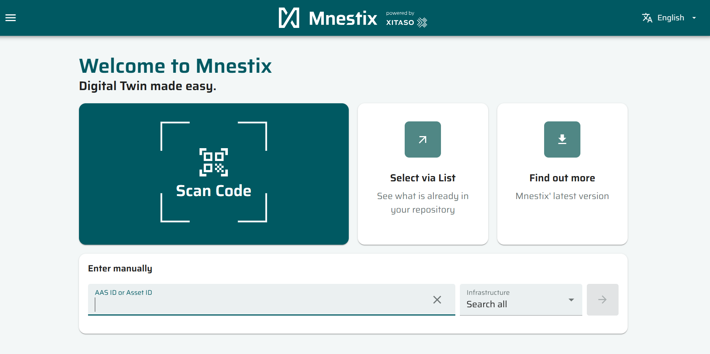
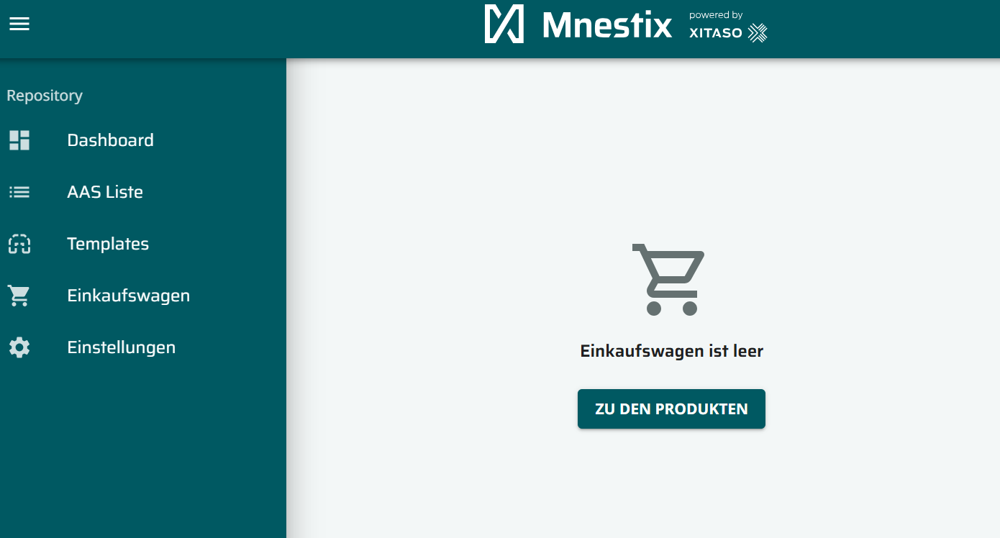
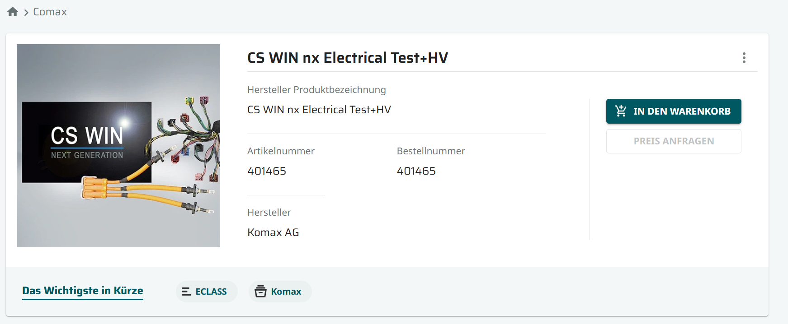
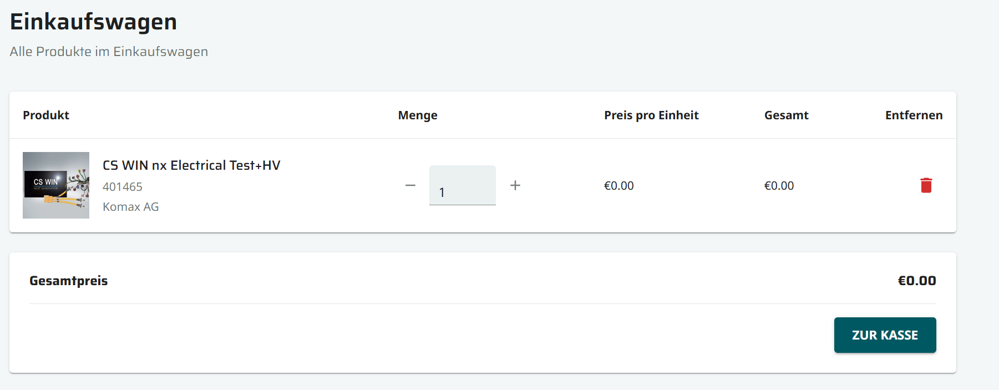
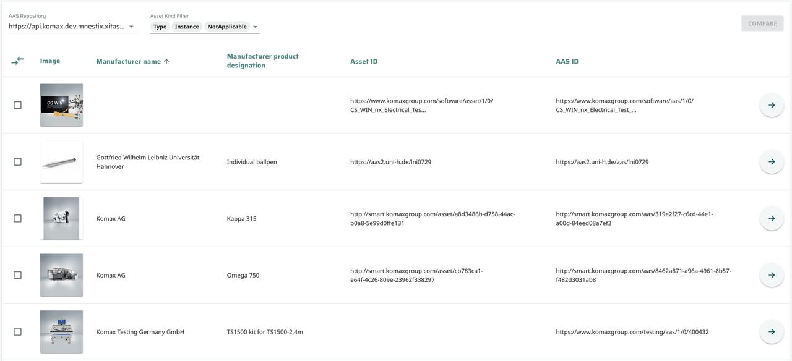
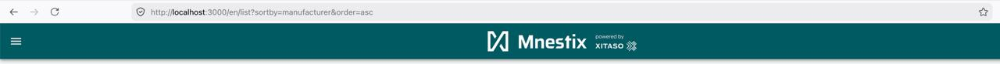
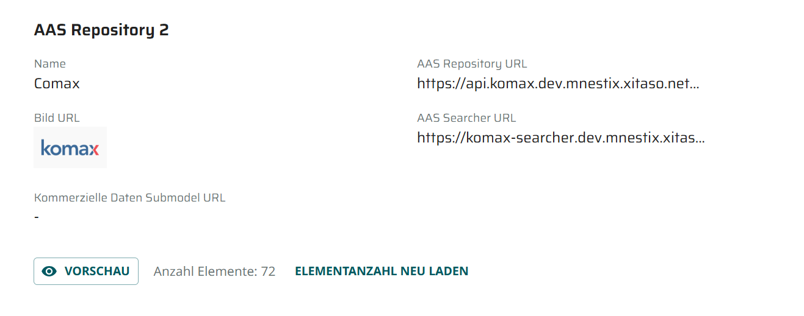
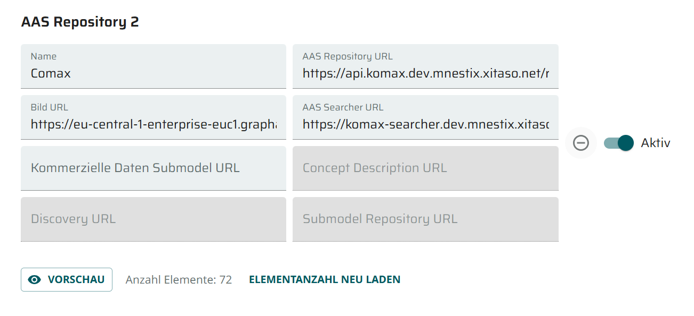
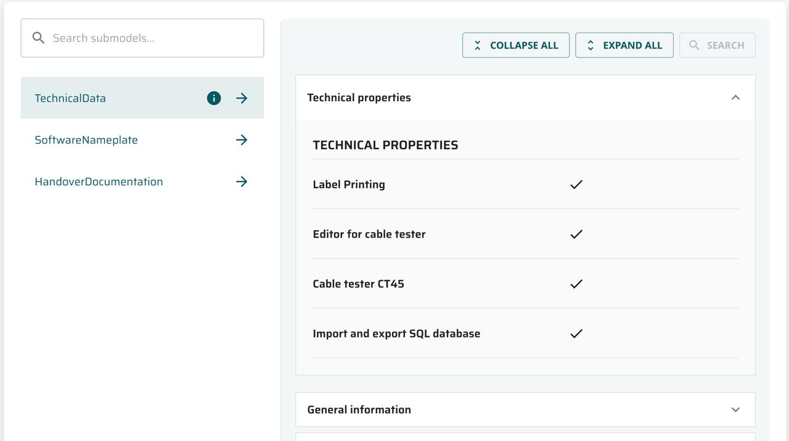

  
  &nbsp;&nbsp;&nbsp;&nbsp;
  

<h1 align="center">Mnestix Browser Extension</h1>

  <em>Team 5 · DHBW · Asset Administration Shell</em>

---

## About Mnestix

Mnestix Product Catalogue is a web-based open-source software designed to simplify the implementation of the **Asset Administration Shell (AAS)**. Its main purpose is to support the creation and management of digital product catalogues, offering various features for browsing and organizing catalogue data.

  

---

## What's New

Several important usability and functionality aspects were missing from a user perspective. This extension focuses on enhancing the application's usability, introducing **eShop functionalities** (e.g., Add to Cart, Shopping Cart view), and refining the presentation of documentation and technical data.

---

## Feature Overview

### E-Shop Functionality

The sidebar now features a dedicated **Shopping Cart / Einkaufswagen** section, allowing users to browse and purchase products directly within the application.

  

 

Products now include an **Add to Cart** button. Selected items are displayed in the cart and can be individually configured. Connecting an external payment service enables direct purchasing.

  
  &nbsp;&nbsp;
  

**Associated Requirements:**

- [SRS-FR-SHOP-001 Cart View Access](/PROJECT/TINF24F_5-SRS.md#srs-fr-shop-001-cart-view-access)
- [SRS-FR-SHOP-002 Cart Products](/PROJECT/TINF24F_5-SRS.md#srs-fr-shop-002-cart-products)
- [SRS-FR-SHOP-003 Cart Quantity](/PROJECT/TINF24F_5-SRS.md#srs-fr-shop-003-cart-quantity)
- [SRS-FR-SHOP-004 Add to Cart Button](/PROJECT/TINF24F_5-SRS.md#srs-fr-shop-004-add-to-cart-button)
- [SRS-FR-SHOP-005 Cart Count Indicator](/PROJECT/TINF24F_5-SRS.md#srs-fr-shop-005-cart-count-indicator)
- [SRS-FR-SHOP-006 Shop Feature Configuration](/PROJECT/TINF24F_5-SRS.md#srs-fr-shop-006-shop-feature-configuration)
- [SRS-FR-SHOP-007 Product Price Display](/PROJECT/TINF24F_5-SRS.md#srs-fr-shop-007-product-price-display)

**Associated Issues:**

- [Shop Functionality](https://github.com/eclipse-mnestix/mnestix-browser/issues/573)

---

### AAS List Improvements

The AAS list table now supports **sorting by every available column**, directly via the table header. The sorting state is also reflected in the URL as a query parameter for easy sharing and bookmarking.

  
    
  

**Associated Requirements:**

- [SRS-FR-LIST-002 AAS List Filtering](/PROJECT/TINF24F_5-SRS.md#srs-fr-list-002-aas-list-filtering)
- [SRS-FR-LIST-003 AAS List Sorting](/PROJECT/TINF24F_5-SRS.md#srs-fr-list-003-aas-list-sorting)
- [SRS-FR-LIST-](/PROJECT/TINF24F_5-SRS.md#)

**Associated Issues:**

- [Sort AAS List](https://github.com/eclipse-mnestix/mnestix-browser/issues/575)
- [Query Parameters for sorting AAS List](https://github.com/eclipse-mnestix/mnestix-browser/issues/570)
- [Filter AAS List by assetKind](https://github.com/eclipse-mnestix/mnestix-browser/issues/568)

---

### Repository Settings Improvements

Each repository now offers a **preview button** on the settings page, giving users a quick look at its contents without navigating away. Repositories can also be **activated or deactivated individually** in the browser.

  
  &nbsp;&nbsp;
  

**Associated Requirements:**

- [SRS-FR-UI-001 Repository AAS Entry Count](/PROJECT/TINF24F_5-SRS.md#srs-fr-ui-001-repository-aas-entry-count)
- [SRS-FR-REPO-001 AAS Repository Configuration](/PROJECT/TINF24F_5-SRS.md#srs-fr-repo-001-aas-repository-configuration)
- [SRS-FR-CONFIG-001 CD Repository Configuration](/PROJECT/TINF24F_5-SRS.md#srs-fr-config-001-cd-repository-configuration)
- [SRS-FR-CONFIG-002 CD Repository Content Inspection](/PROJECT/TINF24F_5-SRS.md#srs-fr-config-002-cd-repository-content-inspection)

**Associated Issues:**

- [Configure CD Repositories](https://github.com/eclipse-mnestix/mnestix-browser/issues/571)
- [View CD Repository contents](https://github.com/eclipse-mnestix/mnestix-browser/issues/572)
- [Show product count per repository](https://github.com/eclipse-mnestix/mnestix-browser/issues/580)

---

### Product View Improvements

The technical data view has been overhauled: columns are now correctly formatted and a **collapsible section menu** allows users to unfold all available information at once.

  

**Associated Requirements:**

- [SRS-FR-UI-002 TechnicalData Submodel Formatting](/PROJECT/TINF24F_5-SRS.md#srs-fr-ui-002-technicaldata-submodel-formatting)

**Associated Issues:**

- [Improved readability of handoverDocumentation with inconsistent data](https://github.com/eclipse-mnestix/mnestix-browser/issues/576)
- [Improvement of Technical Data viewer](https://github.com/eclipse-mnestix/mnestix-browser/issues/567)

### Further Improvements

Additional improvements have been made to:

- **Login options** – streamlined authentication flow
- **Nameplate Generator integration** – seamless connectivity
- And more quality-of-life refinements throughout the application

---

## Team

|       Role       |         Name         |               E-mail               | Matrikelnr |                 Github                  |
| :--------------: | :------------------: | :--------------------------------: | :--------: | :-------------------------------------: |
| Project Manager  |   Hennerich, Felix   | `inf24030@lehre.dhbw-stuttgart.de` |  2594549   | FelixHennerich & privat@felixhenneri.ch |
| Product Manager  |  Schumacher, Julian  | `inf24102@lehre.dhbw-stuttgart.de` |  4931903   |             juliandevelops              |
|   Test Manager   |   Schäffner, Nils    | `inf24109@lehre.dhbw-stuttgart.de` |  5152735   |                 NSZock                  |
|   Test Manager   |     Kruske, Jan      | `inf24027@lehre.dhbw-stuttgart.de` |  1609477   |                 jankrus                 |
| System Architect |     Lange, Bruno     | `inf24077@lehre.dhbw-stuttgart.de` |  4086963   |                  brvn0                  |
| Technical Editor | Gottschewski, Gregor | `inf24065@lehre.dhbw-stuttgart.de` |  3661830   |           Gregor-Gottschewski           |
| Technical Editor |     Kelm, Robin      | `inf24243@lehre.dhbw-stuttgart.de` |  9130160   |                 robk42                  |
