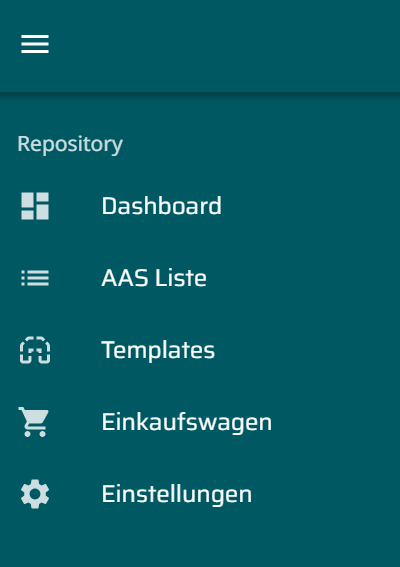

 

<h1 style="text-align: center">Mnestix Browser Extension</h1>

## Welcome to Team 5's Mnestix Browser Extension

_About Mnestix_

Mnestix Product Catalogue is a web-based open-source software designed to simplify the implementation of the Asset Administration Shell (AAS). Its main purpose is to support the creation and management of digital product catalogues, offering various features for browsing and organizing catalogue data.

### New extension

Several important usability and functionality aspects were missing from a user perspective. The improvements focus on enhancing the application’s usability. Furthermore, eShop functionalities (e.g., Add to Cart, Show Cart) will be introduced, and the presentation of documentation and technical data will be refined.

## Feature Overview

### E-Shop functionality

The sidebar now features a new section "Shopping Cart/Einkaufswagen"

This page gives a view into the users shopping cart

Products contain a new button, that enables to add to the users shopping cart

The selected items are displayed in the shopping cart and can be configured.
Adding an external payment service enables to directly by the selected items

The associated requirements can be found here:
[SRS-FR-SHOP-001 Cart View Access](/PROJECT/TINF24F_5-SRS.md#srs-fr-shop-001-cart-view-access)

[SRS-FR-SHOP-002 Cart Products](/PROJECT/TINF24F_5-SRS.md#srs-fr-shop-002-cart-products)

[SRS-FR-SHOP-003 Cart Quantity](/PROJECT/TINF24F_5-SRS.md#srs-fr-shop-003-cart-quantity)

[SRS-FR-SHOP-004 Add to Cart Button](/PROJECT/TINF24F_5-SRS.md#srs-fr-shop-004-add-to-cart-button)

[SRS-FR-SHOP-005 Cart Count Indicator](/PROJECT/TINF24F_5-SRS.md#srs-fr-shop-005-cart-count-indicator)

[SRS-FR-SHOP-006 Shop Feature Configuration](/PROJECT/TINF24F_5-SRS.md#srs-fr-shop-006-shop-feature-configuration)

[SRS-FR-SHOP-007 Product Price Display](/PROJECT/TINF24F_5-SRS.md#srs-fr-shop-007-product-price-display)

### AAS list improvement
---

The table content can now be sorted in the table header by every available column

The sorting is also available in the associated url by a query

[SRS-FR-LIST-002 AAS List Filtering](/PROJECT/TINF24F_5-SRS.md#srs-fr-list-002-aas-list-filtering)
[SRS-FR-LIST-003 AAS List Sorting](/PROJECT/TINF24F_5-SRS.md#srs-fr-list-003-aas-list-sorting)

### Repository Setting improvements
---

For every repository there is now a button to show a preview of its content, while the user is on the settings page

Additionaly, repositories can be activated individually in the browser

[SRS-FR-UI-001 Repository AAS Entry Count](/PROJECT/TINF24F_5-SRS.md#srs-fr-ui-001-repository-aas-entry-count)

[SRS-FR-REPO-001 AAS Repository Configuration](/PROJECT/TINF24F_5-SRS.md#srs-fr-repo-001-aas-repository-configuration)

[SRS-FR-CONFIG-001 CD Repository Configuration](/PROJECT/TINF24F_5-SRS.md#srs-fr-config-001-cd-repository-configuration)

[SRS-FR-CONFIG-002 CD Repository Content Inspection](/PROJECT/TINF24F_5-SRS.md#srs-fr-config-002-cd-repository-content-inspection)

### Product View improvements

The depiction of technical data in the product view is also improved. The columns are corretly edited and there is a button menu to unfold all available information sections

### Further improvements
---
Further improvements happend to login options, Nameplate-Generator integration, ...
## Team Overview

Nils Schäffner, Gregor Gottschewski, Felix Hennerich, Julian Schumacher, Bruno Lange, Jan Kruske und Robin Kelm.
