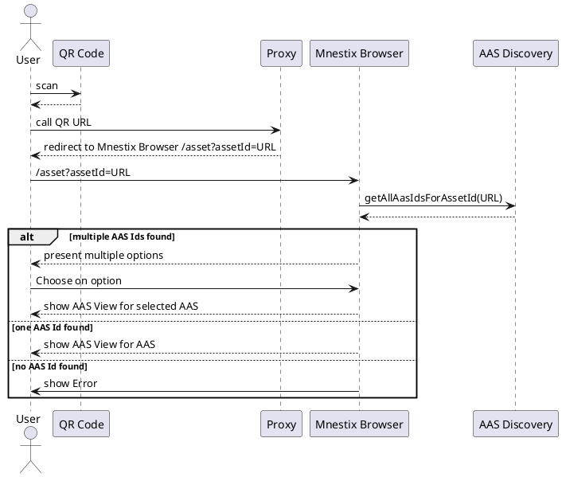

The Mnestix Browser enables you to browse through the different AAS Dataspaces.
It allows you to **visualize Asset Administration Shells and their submodels**. It supports the AAS Metamodel and API in
version 3.

You configure the endpoint of an AAS repository and browse the different AAS, if a Discovery Service is available, it is
also possible to search for AssetIds and visualize the corresponding AAS.

Mnestix AAS Browser is also **optimized for mobile view** to have a **great user experience** on mobile phones.

Mnestix can **visualize every submodel** even if it is not standardized by IDTA. There are some submodels **visualized
in an extra user-friendly manner**. These are:

- Digital Nameplate
- Handover Documentation
- Carbon Footprint
- **and more!**

Moreover, dedicated visualizations for submodels can be added as a further feature.

## Using Mnestix Browser Asset Id Resolving

Mnestix Browser support the automatic resolving of Asset Ids not only via the Main Landing Page but also via a forwarding.
This is especially interesting for Showcases using Mnestix.
Here it is possible to create a QR Code with the Asset Id of the Asset.
The URL / Asset ID behind the QR Code can then point to a server redirecting to the correct Mnestix Instance.
An overview can be seen in the following picture:


<details>
	


</details>

This redirection can be done in multiple ways, here are some solutions, of course there are more solutions possible:

### Solution 1
The Server behind the QR Code is just serving a HTML file that executes a small Javascript to forward the browser of the user to the correct Mnextix instance
```html
<!DOCTYPE html>
<html lang="en">
    <head>
    <meta charset="utf-8">
    <title>Redirecting to AAS Server...</title>
    </head>
    <body>
      Automatically redirecting to <a href=URL >Mnestix</a>.
    <script>
        window.location.replace('https://< PUBLIC MNESTIX URL >/asset?assetId=' + encodeURIComponent(window.location.href));
    </script>
    </body>
</html>
```

### Solution 2
Use a proxy solution that returns a HTTP Response with a  `300+` Redirect Response.
Here is an example rule for Caddy

```Caddyfile
< PUBLIC QR URL > {
	@replaceLeadingSlash {
    	path_regexp ^/(.*)
	}
    
	redir @replaceLeadingSlash https://< PUBLIC MNESTIX URL >/asset/?assetId=https%3A%2F%2F< PUBLIC QR URL >%2F{re.replaceLeadingSlash.1} html
}
```

