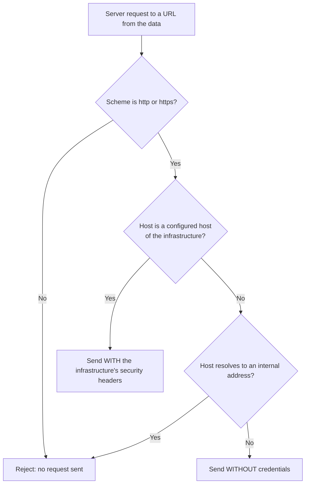

# Mnestix Infrastructure Configuration Guide

Mnestix supports **multiple infrastructures** within a single instance.  
Each infrastructure must have a **unique name** defined for the Mnestix instance.

## Access Control

Infrastructure configuration is restricted:

- Available only to **logged-in admin users**, depending on the instance configuration.
- Regular users cannot view or modify infrastructure settings.

## Infrastructure Components

An infrastructure can consist of the following interface types:

- **AAS Repository Interface**
- **AAS Registry Interface**
- **Submodel Repository Interface**
- **Submodel Registry Interface**
- **Discovery Interface**
- **Concept Description Repository Interface**

> It is not mandatory to configure all of these interfaces.  
> It is **recommended** to configure repositories.

## Endpoint Configuration

When configuring an infrastructure, it is required to:

1. **Provide an endpoint**.
2. **Select the endpoint type**.

Key points to note:

- A **single endpoint** can support multiple types.
- Alternatively, each type can have its own endpoint.
- It is also possible to configure **multiple endpoints of the same type** for one infrastructure.

## Infrastructure Security

Infrastructure security defines **custom security headers** that are added to requests made to configured endpoints.  
There are three security configuration types:

### 1. None (Default)

- No additional security headers are required.
- Suitable for non-secure or open infrastructures.

### 2. Mnestix Repository Proxy

- Used when the infrastructure is deployed as part of a **Mnestix ecosystem with Mnestix Proxy**.
  See the [Mnestix Proxy Wiki](https://github.com/eclipse-mnestix/mnestix-proxy/wiki) for proxy setup and configuration.
- Requires an **API key configuration** from the Proxy and Template Builder.
- The API key is **encrypted** and cannot be retrieved later.
- The correct header is created automatically:
    - Depending on the Mnestix version, it will be either:
        - `ApiKey`
        - `X-API-KEY`

### 3. Header Security

- Allows configuring **custom security headers** and their values.
- As with the Proxy type, the values are **encrypted** and cannot be retrieved later.

## How Requests Use This Configuration

Some content is fetched by the Mnestix server directly from a URL stored **inside the data** — for example a file or attachment referenced by a submodel, or a repository URL carried in a transfer. Because those URLs come from the data rather than from the infrastructure configuration, Mnestix applies two rules whenever it makes such a request on the server.

### Credentials are host-scoped

The security headers configured above are attached to an outbound request **only when the request's target host matches one of the hosts configured for that infrastructure**.

- Target host **is** a configured endpoint of the infrastructure → the request is sent **with** the security headers.
- Target host is **not** configured for the infrastructure → the request is sent **without** those headers.

Matching is done on the **host name**; the port and scheme are not part of the match. So the credentials are only ever sent to that infrastructure's own hosts.

### Internal targets are restricted

Each outbound request is also checked against the address its host resolves to:

- A request to a **configured host** is always allowed — including a host on a private network that is only reachable inside your deployment (for example `backend:8081`).
- A request to a **public host that is not configured** is allowed, but (as above) without any credentials.
- A request to a **non-configured internal address is rejected** — this covers loopback, link-local, cloud-metadata, and private network ranges, for both IPv4 and IPv6.
- A request using a scheme other than `http`/`https` is rejected.

When a request is rejected, the action returns an error and no request is sent.

| Target | Credentials | Request |
|---|---|---|
| Configured host (public **or** private) | attached | sent |
| Public host, not configured | none | sent |
| Internal address, not configured | none | **rejected** |
| Non-`http`/`https` scheme | — | **rejected** |

> A repository or file that lives on your configured infrastructure keeps working exactly as before. The rules only change what happens for hosts you have **not** configured.

## Authentication Note

At the moment, Mnestix only supports the three security configurations described above.  
**Other authentication methods (e.g., OpenID, OAuth2, SAML, etc.) are not supported.**

👉 If your use case requires additional authentication mechanisms, please **contact us** for support or feature requests.

## Secret Encryption Key

A critical environment variable must be set for each Mnestix instance:

- **`SECRET_ENC_KEY`**
    - Must be a **base64-encoded 32-byte secret key** (44 characters).
    - Used for secret encryption and decryption.

### ⚠️ Warning

- If `SECRET_ENC_KEY` is **not provided**, Mnestix will generate a random key at startup.
    - **This applies only when the application is started locally.**
    - In **Docker environments**, a validation script enforces this requirement and will **throw an exception** if the variable is missing or incorrectly set.
- The generated key will **not be retrievable**.
- This option should **never** be used in a production environment.
- It is intended **only for testing purposes**.
