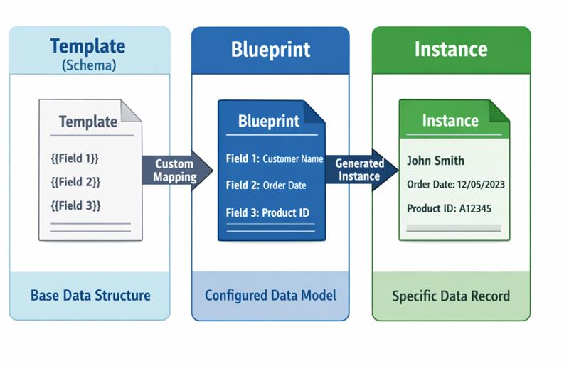

# Data Ingest & Blueprint Guide

This guide explains how to use the AAS Generator to create Submodels from structured data using Blueprints. The concepts apply to both:

- **DataIngest endpoint** (`POST /api/v2/DataIngest/{base64EncodedAasId}`) - Adds submodels to an **existing** AAS
- **AasCreator endpoint** (`POST /api/v2/AasCreator/{assetIdShort}`) - Creates a **new** AAS with submodels

For detailed endpoint specifications, see the [API Reference](Mnestix-AAS-Generator-API-Reference).


---

## Overview: Template → Blueprint → Instance

The AAS Generator transforms structured JSON data into AAS-compliant Submodel instances using a three-tier architecture:



| Tier          | Description                                                                                                                                                        | Created By                              |
| ------------- | ------------------------------------------------------------------------------------------------------------------------------------------------------------------ | --------------------------------------- |
| **Template**  | A base Submodel schema defining the structure. Often based on IDTA standards (e.g., Nameplate, ContactInformation). Has `kind: "Template"` and placeholder fields. | API endpoint or imported from standards |
| **Blueprint** | A Template with added mapping rules (qualifiers) that define how JSON data maps to each field.                                                                     | Users via Mnestix Browser UI or API     |
| **Instance**  | The final generated Submodel with `kind: "Instance"` and actual data values populated from the input JSON.                                                         | AAS Generator (automatically)           |

> **Tip**: The [Mnestix Browser](https://github.com/eclipse-mnestix/mnestix-browser) provides a visual "Templates and Blueprints" section that simplifies blueprint creation and management.

---

## Prerequisites

To use this you need a fully configured Mnestix Browser and Mnestix AAS Generator instance, like when starting our [`compose.yml` file](https://github.com/eclipse-mnestix/mnestix-browser/blob/main/compose.yml).

For beginners we recommend using the AAS Generator without additional authentication as it simplifies initial testing.

- Mnestix AAS Generator
- Mnestix Browser
- A way to call HTTP endpoints (Python, Insomnia, curl, ...)

### Setup

Setup a full Mnestix Infrastructure deployment by running:

```bash
docker compose -f compose.yml up
```

This will start everything needed.

---

## Step-by-Step Tutorial

### 1. Prepare Your Data JSON

The Data JSON typically comes from an ETL (Extract Transform Load) tool, like [Apache Camel](https://camel.apache.org/) (Open Source), [Soffico Orchestra](https://soffico.de/produkte/) (Paid), or similar tools.

Example data extracted from your existing system:

```json
{
    "basis": {
        "serialnumber": "123",
        "manufacturer": "ACME Corp",
        "modelName": "ProductXYZ"
    },
    "productionDate": "2023-05-15"
}
```

### 2. Create a Blueprint in Mnestix Browser

1. Access the Template Builder in the Menu under **"Templates"**
2. Click **"Create new"** to create a new blueprint
3. Select a base template (e.g., Nameplate Submodel)
4. Fill out static information (values that don't change)
5. For dynamic information, create a **"Mapping Info"** field with the JSON path


You can find the blueprint ID in the URL after `.../templates`:

`MNESTIX_HOST/en/templates/`**`Nameplate_Template_7e18dcd0-c367-4626-a97e-be44f5fe1852`**

Click **"Save Changes"** to save the blueprint.

### 3. Make a Request

#### Option A: Add Submodel to Existing AAS (DataIngest)

```http
POST /api/v2/DataIngest/{base64EncodedAasId}
Content-Type: application/json
X-API-KEY: your-api-key
```

```json
{
    "blueprintsIds": ["Nameplate_Template_7e18dcd0-c367-4626-a97e-be44f5fe1852"],
    "data": {
        "basis": {
            "serialnumber": "123",
            "manufacturer": "ACME Corp",
            "modelName": "ProductXYZ"
        },
        "productionDate": "2023-05-15"
    },
    "language": "en"
}
```

#### Option B: Create New AAS with Submodel (AasCreator)

```http
POST /api/v2/AasCreator/{assetIdShort}
Content-Type: application/json
X-API-KEY: your-api-key
```

```json
{
    "blueprintsIds": ["Nameplate_Template_7e18dcd0-c367-4626-a97e-be44f5fe1852"],
    "data": {
        "basis": {
            "serialnumber": "123",
            "manufacturer": "ACME Corp",
            "modelName": "ProductXYZ"
        },
        "productionDate": "2023-05-15"
    },
    "language": "en"
}
```

After the request, you should see the filled-out submodel in the AAS.


---

## Template Qualifiers (Mapping Rules)

Mapping rules are embedded as **qualifiers** within Submodel elements. The AAS Generator reads these qualifiers during processing to determine how to populate values.

### Qualifier Format

```json
{
    "kind": "TemplateQualifier",
    "type": "SMT/<RuleType>",
    "value": "<rule-configuration>",
    "valueType": "xs:string"
}
```

### Available Rule Types

| Qualifier Type              | Purpose                                         |
| --------------------------- | ----------------------------------------------- |
| `SMT/MappingInfo`           | Map a JSON path to an element's value           |
| `SMT/CollectionMappingInfo` | Duplicate an element for each array item        |
| `SMT/Cardinality`           | Define whether the data is required or optional |

---

## Rule Type Details

### 1. Static Values (No Qualifier)

For fields with constant values that don't change between instances, simply set the value directly in the blueprint without any mapping qualifier.

**Blueprint:**

```json
{
    "modelType": "Property",
    "idShort": "ManufacturerCountry",
    "valueType": "xs:string",
    "value": "Germany"
}
```

**Result:** The value `"Germany"` is copied unchanged to every generated instance.

---

### 2. Path Mapping (`SMT/MappingInfo`)

Maps a JSON path from the input data to an element's value. This is the most common rule type.

**Blueprint Element:**

```json
{
    "modelType": "Property",
    "idShort": "SerialNumber",
    "valueType": "xs:string",
    "value": "",
    "qualifiers": [
        {
            "kind": "TemplateQualifier",
            "type": "SMT/MappingInfo",
            "value": "product.serialNumber",
            "valueType": "xs:string"
        }
    ]
}
```

**Input Data:**

```json
{
    "product": {
        "serialNumber": "SN-12345-XYZ"
    }
}
```

**Generated Instance:**

```json
{
    "modelType": "Property",
    "idShort": "SerialNumber",
    "valueType": "xs:string",
    "value": "SN-12345-XYZ"
}
```

#### Path Expression Syntax

| Expression     | Description                      | Example                |
| -------------- | -------------------------------- | ---------------------- |
| `field`        | Top-level field                  | `serialNumber`         |
| `parent.child` | Nested object access             | `product.details.name` |
| `array[0]`     | Specific array index             | `contacts[0].name`     |
| `array[*]`     | Array wildcard (for collections) | `contacts[*].email`    |

---

### 3. Collection Mapping (`SMT/CollectionMappingInfo`)

Duplicates a Submodel element for each item in an array. This enables dynamic list generation.

**Use Case:** You have an array of contacts and want to create a `ContactPerson` collection for each one.

**Blueprint Element:**

```json
{
    "modelType": "SubmodelElementCollection",
    "idShort": "contactPerson",
    "qualifiers": [
        {
            "type": "SMT/CollectionMappingInfo",
            "value": "sourceData.contactPersons[*]"
        }
    ],
    "value": [
        {
            "modelType": "Property",
            "idShort": "Name",
            "valueType": "xs:string",
            "qualifiers": [
                {
                    "type": "SMT/MappingInfo",
                    "value": "sourceData.contactPersons[*].name"
                }
            ]
        },
        {
            "modelType": "Property",
            "idShort": "Email",
            "valueType": "xs:string",
            "qualifiers": [
                {
                    "type": "SMT/MappingInfo",
                    "value": "sourceData.contactPersons[*].email"
                }
            ]
        }
    ]
}
```

**Input Data:**

```json
{
    "sourceData": {
        "contactPersons": [
            { "name": "John Doe", "email": "john@example.com" },
            { "name": "Jane Smith", "email": "jane@example.com" }
        ]
    }
}
```

**Generated Instance:**

```json
{
    "value": [
        {
            "modelType": "SubmodelElementCollection",
            "idShort": "contactPerson_0",
            "value": [
                { "idShort": "Name", "value": "John Doe" },
                { "idShort": "Email", "value": "john@example.com" }
            ]
        },
        {
            "modelType": "SubmodelElementCollection",
            "idShort": "contactPerson_1",
            "value": [
                { "idShort": "Name", "value": "Jane Smith" },
                { "idShort": "Email", "value": "jane@example.com" }
            ]
        }
    ]
}
```

#### How Collection Processing Works

1. The generator finds all `SMT/CollectionMappingInfo` qualifiers
2. Qualifiers are sorted by **nesting depth** (shallowest first) - counted by `[*]` occurrences
3. For each array item in the data, the element is duplicated
4. The `idShort` is suffixed with an index (`_0`, `_1`, `_2`, ...)
5. Child element paths have `[*]` replaced with the actual index (`[0]`, `[1]`, ...)
6. The process repeats recursively for nested collections

#### Nested Collections

The generator supports nested collections (arrays within arrays). The algorithm processes collections from shallowest to deepest.

**Example:** Contact persons with multiple phone numbers each.

**Blueprint paths:**

```
sourceData.contactPersons[*]                    # Outer collection
sourceData.contactPersons[*].phone_numbers[*]   # Nested collection
sourceData.contactPersons[*].phone_numbers[*].value  # Value in nested collection
```

**Input Data:**

```json
{
    "sourceData": {
        "contactPersons": [
            {
                "name": "SpongeBob",
                "phone_numbers": [{ "name": "Office", "value": "+1 234 56789" }]
            },
            {
                "name": "Squidward",
                "phone_numbers": [
                    { "name": "Office", "value": "+2 234 56789" },
                    { "name": "Cell", "value": "+2 1907 1234" }
                ]
            }
        ]
    }
}
```

**Result:** Creates `contactPerson_0` with one phone number, and `contactPerson_1` with two phone numbers (`phone_numbers_0`, `phone_numbers_1`).

---

### 4. Cardinality (`SMT/Cardinality`)

Defines whether a mapped value is required or optional.

| Value       | Behavior                                                       |
| ----------- | -------------------------------------------------------------- |
| `One`       | **Mandatory** - Generation fails with error if data is missing |
| `ZeroToOne` | **Optional** - Empty value is set if data is missing           |

**Complete Element with Cardinality:**

```json
{
    "modelType": "Property",
    "idShort": "SerialNumber",
    "valueType": "xs:string",
    "value": "",
    "qualifiers": [
        {
            "type": "SMT/Cardinality",
            "value": "One"
        },
        {
            "type": "SMT/MappingInfo",
            "value": "product.serialNumber"
        }
    ]
}
```

If `product.serialNumber` is missing in the input data:

- With `"One"`: Error thrown, generation fails
- With `"ZeroToOne"`: Element created with empty value

---

## Supported Submodel Element Types

The following element types support data mapping via qualifiers:

| Element Type                | Mapping Support | Notes                               |
| --------------------------- | --------------- | ----------------------------------- |
| `Property`                  | ✅ Full         | Standard value mapping              |
| `MultiLanguageProperty`     | ⚠️ Limited      | Single language per generation call |
| `SubmodelElementCollection` | ✅ Full         | Supports collection duplication     |
| `SubmodelElementList`       | ✅ Full         | Supports collection duplication     |

Elements that are **not** directly mapped but are preserved in the output:

| Element Type       | Behavior                        |
| ------------------ | ------------------------------- |
| `Range`            | Copied unchanged from blueprint |
| `Blob`             | Copied unchanged from blueprint |
| `File`             | Copied unchanged from blueprint |
| `ReferenceElement` | Copied unchanged from blueprint |
| `Entity`           | Copied unchanged from blueprint |

---

## MultiLanguageProperty Limitation

Currently, `MultiLanguageProperty` elements support only **one language per generation call**. The language is specified in the API request body.

**Request:**

```json
{
    "blueprintsIds": ["my-blueprint"],
    "data": { "description": "Product description text" },
    "language": "en"
}
```

**Generated MLP:**

```json
{
    "modelType": "MultiLanguageProperty",
    "idShort": "Description",
    "value": [{ "language": "en", "text": "Product description text" }]
}
```

To add multiple languages, make separate API calls or edit the generated submodel afterward.

---

## Debug Mode

Set `"debug": true` in your request to receive detailed logs about the generation process. This helps diagnose mapping issues.

**Request:**

```json
{
  "blueprintsIds": ["contact-info-v1"],
  "data": { ... },
  "language": "en",
  "debug": true
}
```

**Response with debug info:**

```json
{
    "results": [
        {
            "blueprintId": "contact-info-v1",
            "success": true,
            "generatedSubmodelId": "https://example.com/submodels/abc123",
            "debugInfo": {
                "logs": [
                    "Started DuplicateCollectionsStep",
                    "Processing collection at path 'company.employees[*]' (depth: 1, mandatory: false, elements: 2)",
                    "Successfully duplicated 2 elements for collection...",
                    "Finished DuplicateCollectionsStep",
                    "Started MapDataToInstanceStep",
                    "Successfully mapped value 'ACME Corporation' from path 'company.name'",
                    "..."
                ]
            }
        }
    ]
}
```

---

## Error Handling

### Common Errors

| Error                                                             | Cause                                      | Solution                                      |
| ----------------------------------------------------------------- | ------------------------------------------ | --------------------------------------------- |
| `Mandatory mapping 'path' not found`                              | Required field missing in input data       | Add data or change cardinality to `ZeroToOne` |
| `could not find matching value field`                             | Malformed qualifier or element structure   | Verify blueprint JSON structure               |
| `parent must be SubmodelElementCollection or SubmodelElementList` | Collection qualifier on wrong element type | Move qualifier to SMC or SML element          |

### Error Response Format

```json
{
    "results": [
        {
            "blueprintId": "my-blueprint",
            "success": false,
            "message": "Mandatory mapping 'product.serialNumber' not found.",
            "errorInfo": {
                "logs": ["...processing steps before error..."],
                "qualifier": "SMT/MappingInfo",
                "qualifierPath": "product.serialNumber"
            }
        }
    ]
}
```

---

## Data Preparation Best Practices

The AAS Generator expects input data as a **homogeneous JSON structure**. Before calling the API, transform your source data appropriately.

### Common Data Sources

| Source                       | Transformation Needed                       |
| ---------------------------- | ------------------------------------------- |
| ERP Systems (SAP, etc.)      | Export to JSON, flatten nested structures   |
| Excel/CSV                    | Convert to JSON array of objects            |
| Engineering Tools (PLM, CAD) | Use tool's JSON export or build integration |
| Databases                    | Query and serialize to JSON                 |

### Data Structure Best Practices

1. **Flatten deeply nested structures** where possible
2. **Use consistent field names** across all records
3. **Ensure arrays contain homogeneous objects** (same fields in each item)
4. **Handle null/missing values** before submission (or rely on cardinality rules)

**Example transformation:**

```
Excel Row:
| Product | Serial | Contact1_Name | Contact1_Email | Contact2_Name | Contact2_Email |

Transformed JSON:
{
  "product": "Widget",
  "serial": "W-001",
  "contacts": [
    { "name": "...", "email": "..." },
    { "name": "...", "email": "..." }
  ]
}
```

---

## Complete Blueprint Example

Here's a complete blueprint for a contact information submodel:

```json
{
    "modelType": "Submodel",
    "kind": "Template",
    "id": "https://example.com/blueprints/contact-info-v1",
    "idShort": "ContactInformation",
    "semanticId": {
        "type": "ExternalReference",
        "keys": [
            {
                "type": "GlobalReference",
                "value": "https://admin-shell.io/zvei/nameplate/1/0/ContactInformations"
            }
        ]
    },
    "submodelElements": [
        {
            "modelType": "Property",
            "idShort": "CompanyName",
            "valueType": "xs:string",
            "value": "",
            "qualifiers": [
                {
                    "kind": "TemplateQualifier",
                    "type": "SMT/Cardinality",
                    "value": "One",
                    "valueType": "xs:string"
                },
                {
                    "kind": "TemplateQualifier",
                    "type": "SMT/MappingInfo",
                    "value": "company.name",
                    "valueType": "xs:string"
                }
            ]
        },
        {
            "modelType": "SubmodelElementCollection",
            "idShort": "Contacts",
            "value": [
                {
                    "modelType": "SubmodelElementCollection",
                    "idShort": "Contact",
                    "qualifiers": [
                        {
                            "kind": "TemplateQualifier",
                            "type": "SMT/Cardinality",
                            "value": "ZeroToOne",
                            "valueType": "xs:string"
                        },
                        {
                            "kind": "TemplateQualifier",
                            "type": "SMT/CollectionMappingInfo",
                            "value": "company.employees[*]",
                            "valueType": "xs:string"
                        }
                    ],
                    "value": [
                        {
                            "modelType": "Property",
                            "idShort": "FullName",
                            "valueType": "xs:string",
                            "qualifiers": [
                                {
                                    "type": "SMT/MappingInfo",
                                    "value": "company.employees[*].fullName"
                                }
                            ]
                        },
                        {
                            "modelType": "Property",
                            "idShort": "Email",
                            "valueType": "xs:string",
                            "qualifiers": [
                                {
                                    "type": "SMT/MappingInfo",
                                    "value": "company.employees[*].email"
                                }
                            ]
                        },
                        {
                            "modelType": "Property",
                            "idShort": "Phone",
                            "valueType": "xs:string",
                            "qualifiers": [
                                {
                                    "type": "SMT/Cardinality",
                                    "value": "ZeroToOne"
                                },
                                {
                                    "type": "SMT/MappingInfo",
                                    "value": "company.employees[*].phone"
                                }
                            ]
                        }
                    ]
                }
            ]
        }
    ]
}
```

**Corresponding Input Data:**

```json
{
    "company": {
        "name": "ACME Corporation",
        "employees": [
            {
                "fullName": "Alice Johnson",
                "email": "alice@acme.com",
                "phone": "+1-555-0101"
            },
            {
                "fullName": "Bob Williams",
                "email": "bob@acme.com"
            }
        ]
    }
}
```

---

## Further Reading

- [API Reference](Mnestix-AAS-Generator-API-Reference) - Complete REST API specification
- [AAS Generator Overview](Mnestix-AAS-Generator) - Setup and configuration
- [XITASO Article](https://xitaso.com/automatisierte-erstellung-von-aas/) - Detailed explanation (German)
