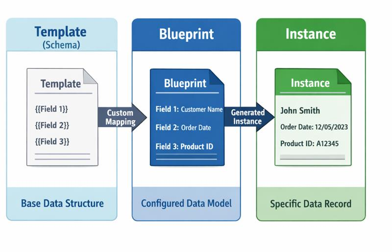
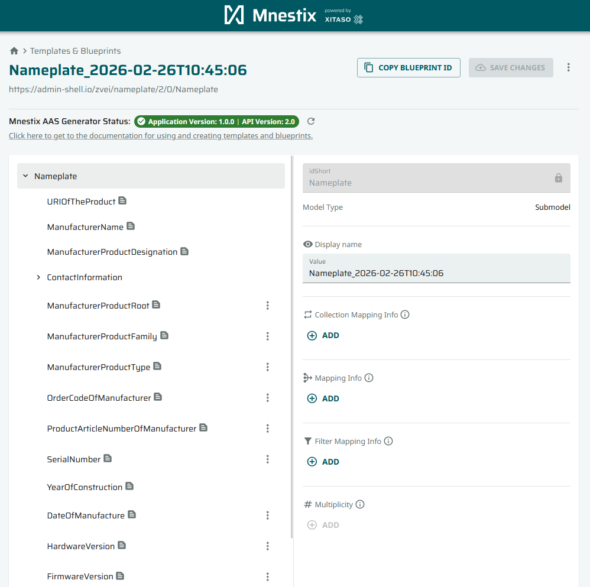
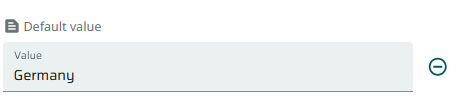
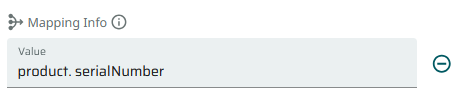
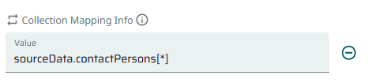
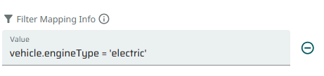
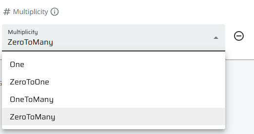

# Templates and Blueprints

The **Templates and Blueprints** page is the visual editor in the Mnestix Browser for creating and
managing **Blueprints** — Submodel templates enriched with mapping rules that describe how incoming data
is turned into AAS Submodels.

> **Works together with the Mnestix AAS Generator.** The Templates and Blueprints editor only authors the blueprints.
> The actual data ingest and Submodel instance generation is performed by the
> [Mnestix AAS Generator](https://github.com/eclipse-mnestix/mnestix-aas-generator/wiki).
> For the full blueprint format, the mapping-rule qualifiers, Jsonata reference, and the
> `DataIngest` / `AasCreator` API endpoints, see the
> [AAS Generator Wiki](https://github.com/eclipse-mnestix/mnestix-aas-generator/wiki).

---

## Template → Blueprint → Instance

A blueprint sits between a base **Template** and the generated **Instance**:

| Tier          | Description                                                                                                    | Created by                               |
| ------------- | -------------------------------------------------------------------------------------------------------------- | ---------------------------------------- |
| **Template**  | A base Submodel schema, often based on IDTA standards (e.g. Nameplate, ContactInformation), with placeholders. | API endpoint or imported standard        |
| **Blueprint** | A Template with added mapping rules that define how input data maps to each field.                             | You, via the Templates and Blueprints UI |
| **Instance**  | The final generated Submodel with actual values populated from the input data.                                 | AAS Generator (automatically)            |

---

## Creating a Blueprint

1. Open the **Templates and Blueprints** page from the menu under **"Templates"**.
2. Click **"Create new"** to start a new blueprint.
3. Select a base template (e.g. the Nameplate Submodel).
4. Fill out the **static information** — values that are the same for every instance.
5. For **dynamic information**, add a **"Mapping Info"** field with the path to the value in your input data.
6. Click **"Save Changes"** to store the blueprint.

Saved blueprints can then be referenced by their id when calling the AAS Generator.

---

## Mapping Rule Types

Each Submodel element in a blueprint can be configured with one of the following rules. These are stored
as qualifiers on the element; the [AAS Generator](https://github.com/eclipse-mnestix/mnestix-aas-generator/wiki)
reads them during generation. The sections below show how each rule appears in the Templates and Blueprints editor.

### Static values

For fields with a constant value, set the value directly without any mapping. The value is copied
unchanged into every generated instance.

### Path mapping

Maps a path (or Jsonata expression) from the input data to the element's value. This is the most common
rule type.

### Collection mapping

Duplicates a Submodel element for each item in an array, enabling dynamic lists. Use `[*]` in the child
element paths to reference the current array item.

### Filter rules

Conditionally includes or excludes an element based on a boolean Jsonata expression evaluated against the
input data — for example, including battery specifications only for electric vehicles.

### Cardinality

Defines whether an element is required or optional, and whether multiple instances are allowed in the
local scope (`One`, `ZeroToOne`, `OneToMany`, `ZeroToMany`).

---

## Next Steps

- For the complete rule reference, qualifier JSON format, Jsonata functions, and nested collection
  behaviour, see the [AAS Generator Wiki](https://github.com/eclipse-mnestix/mnestix-aas-generator/wiki).
- To trigger generation from your blueprints, use the AAS Generator's `DataIngest` (add Submodels to an
  existing AAS) or `AasCreator` (create a new AAS) endpoints, documented in the AAS Generator Wiki.
